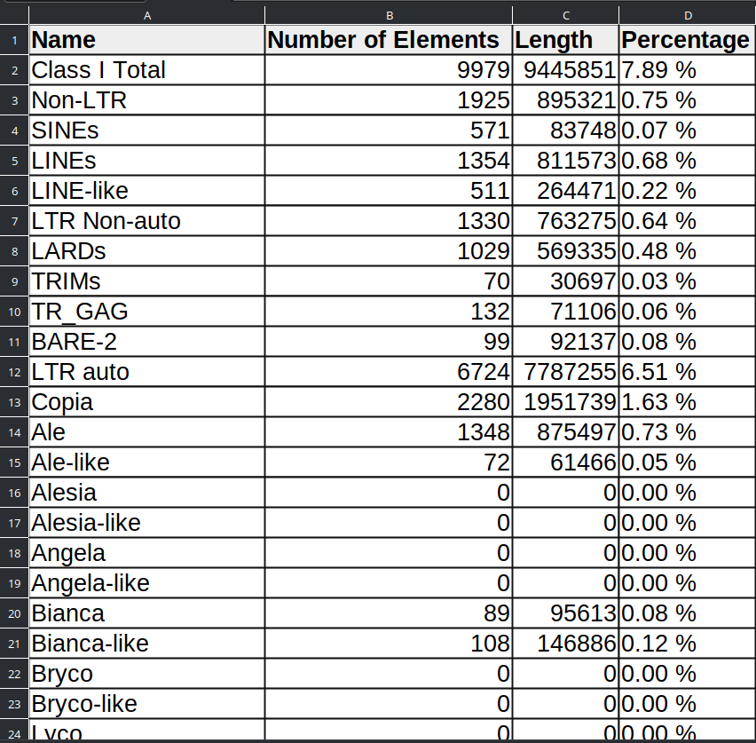
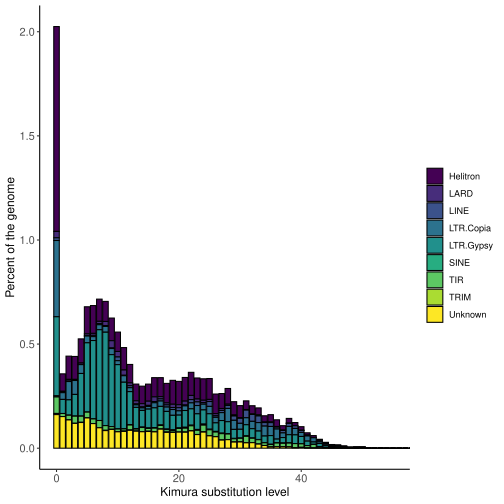
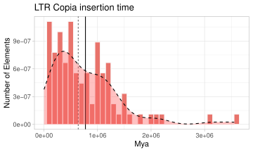
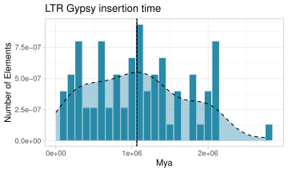
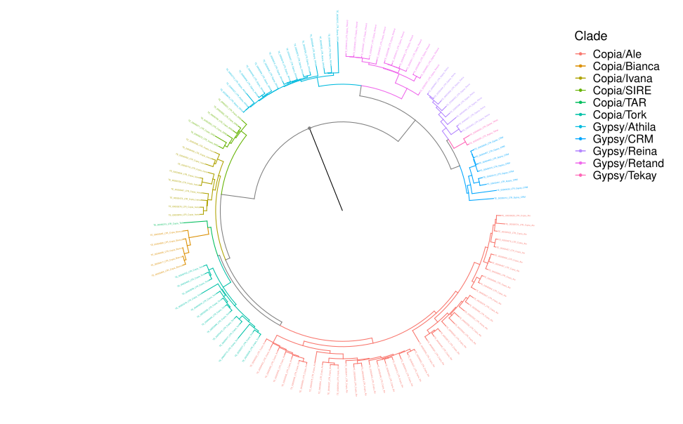

<div align="center"> 
    
</div><br>


# AnnoTEP
AnnoTEP é uma plataforma dedicada à anotação de elementos transponíveis (TEs) em genomas de plantas. Construída com base no pipeline [Plant genome Annotation](https://github.com/amvarani/Plant_Annotation_TEs), combina ferramentas de anotação sofisticadas integrada com recursos HTML para oferecer uma experiência aprimorada aos pesquisadores durante o processo de anotação. Ao integrar essas ferramentas com uma interface amigável, AnnoTEP visa facilitar e otimizar o trabalho de anotação de TEs, fornecendo uma solução eficaz para a análise genômica de plantas.

Atualmente, o AnnoTEP está disponível em três formatos: Web Server, Home Server com Interface e Home Server Terminal. Clicando em cada formato abaixo, você será direcionado para o sistema de acesso ou instalação da plataforma:
- [Web Server](http://150.230.81.111:5000/) 
- [Home server with interface](#home-server-with-interface)
- [Home server in terminal](#home-server-in-terminal)

## Funções da ferramenta
* Identificação, validação e anotação dos elementos SINE e LINE
* Mascaramento dos genomas (mode home server)
* Geração de relatório sobre TEs
* Geração de gráficos ilustrando os elementos repetidos
* Geração de gráficos de idade dos elementos Gypsy e Copia
* Geração de gráfico da filogenia e densidade dos TEs

# Conteúdo

[Installation with Docker](#installation-with-docker)

[Installation with github](#installation-with-github)

[Results](#results)


# Installation with Docker
AnnoTEP pode ser instalado na máquina de diferentes forma, e uma delas é utilizando o Docker. A ferramenta está disponível em dois formatos: com interface gráfica e sem interface (modo terminal). Para seguir com as etapas abaixo, é necessário ter o Docker instalado na sua máquina. Você pode baixá-lo diretamente do site oficial do [Docker](https://docs.docker.com/engine/install/)


## Home server with interface
- Importante: para essa versão sua máquina precisar ter acesso a rede de internet

Abra o terminal e execute os seguintes comandos:
Etapa 1. Baixe a imagem do AnnoTEP:
```sh
    docker pull annotep-local-interface:v1
```

Etapa 2. Em seguida, execute o contêiner com o comando abaixo, substituindo ``caminho/diretorio/results`` pelo diretório onde você deseja armazenar os resultados gerados pela anotação:
```sh
     docker run -it -v /caminho/diretorio/results:/root/TEs/www/results --name local-interface -dp 0.0.0.0:5000:5000 annotep-local-interface:v1
```

Exemplo diretorio de resultados:
```sh
     docker run -it -v $HOME/Documents/results:/root/TEs/www/results --name local-interface -dp 0.0.0.0:5000:5000 annotep-local-interface:v1
```

#### Description:
- ``-v $HOME/Documents/results:/root/TEs/www/results``: This creates a volume between the host and the container to store data. You can replace ``-v $HOME/results`` with any path on your machine. This is where your result data will be saved.
- ``--name local-interface``: Sets the name of the container to "local-interface".
- ``-dp 0.0.0.0:5000:5000``: Maps the container's port 5000 to the host's port 5000.
- ``annotep-local-interface:v1``: Specifies the image to be used.

Etapa 3. Depois de executar o contêiner com o comando anterior, acesse a interface do AnnoTEP digitando o seguinte endereço no seu navegador web: 
``127.0.0.1:5000``

Etapa 4. Ao acessar 127.0.0.1:5000 você irá visualizar uma versão da plataforma AnnoTEP similar a versão WEB. 

Etapa 5. Dentro da interface você poderá está inserindo seus dados como: email, genoma e tipo de anotação e enviando para a análise. Quando o trabalho for concluído sem nenhum erro, você receberá um e-mail informando que os resultados estão disponíveis no diretório informando em ``caminho/diretorio/results``.

- [Sobre o tipo de anotação](#type-annotation)

- Importante2: não desligue a máquina enquanto realizar o processo de anotação, você poderá está desligando após recebimento do email informando o fim da anotação.

## Home server in terminal
Etapa 1. Baixe a imagem do AnnoTEP:
```sh
    docker pull annotep-local-terminal:v1
```

Etapa 2. Em seguida, execute o contêiner com o comando abaixo, substituindo ``caminho/diretorio/results`` pelo diretório onde você deseja armazenar os resultados gerados pela anotação, e ``caminho/diretorio/genome`` pelo diretório onde está localizado seu genoma:
```sh
    sudo docker run -it -v /caminho/diretorio/results:/root/TEs/local/results -v /home/user/TEs:/caminho/diretorio/genome "nome_da_imagem" python run_annotep.py --file {/caminho/diretorio/genome/genome.fasta} --type {type-annotation}
```

No parâmetro ``--file``, adicione o mesmo diretório do genoma seguido pelo nome do genoma a ser utilizado no formato .fasta.
No parâmetro ``--type``, coloque o número correspondente ao tipo de anotação que deseja realizar: 
[1] SINE Annotation 
[2] LINE Annotation
[3] SINE and LINE annotation
[4] Complete Annotation.

Exemplo:
```sh
    sudo docker run -it -v $HOME/results:/root/TEs/local/results -v $HOME/TEs:$HOME/TEs annotep-local-terminal:v1 python run_annotep.py --file $HOME/TEs/Athaliana.fasta --type 2
```

Etapa 3. Agora aguarde a finalização na anotação do genoma acompanhando a análise pelo terminal
 

# Installation with github

## Prerequisitos
- [Python 3.7+](https://www.python.org/)

- [Miniconda3](https://docs.conda.io/projects/miniconda/en/latest/)

- System Ubuntu

## Baixe o repositório
Etapa 1. No terminal rode:
```sh
git clone https://github.com/Marcos-Fernando/TEP.git $HOME/TEs
```

Etapa 2. Acesse o local do repositório na máquina:
```sh
cd $HOME/TEs
```
### Configurando o repositório
### Bibliotecas
Etapa 1. No terminal baixe as seguintes bibliotecas:
```sh
sudo apt-get install lib32z1 python-is-python3 python3-setuptools python3-biopython python3-xopen trf hmmer2 seqtk
sudo apt-get install hmmer emboss python3-virtualenv python2 python2-setuptools-whl python2-pip-whl cd-hit iqtree
sudo apt-get install python2-dev build-essential linux-generic libmpich-dev libopenmpi-dev bedtools pullseq bioperl
sudo apt-get install pdf2svg

# R dependencies
sudo apt-get install r-cran-ggplot2 r-cran-tidyr r-cran-reshape2 r-cran-reshape rs r-cran-viridis r-cran-tidyverse r-cran-gridextra r-cran-gdtools r-cran-phangorn r-cran-phytools r-cran-ggrepel
```
Acesse o programa R pelo teminal e instale bibliotecas por dentro dele:

```sh
R

install.packages("hrbrthemes")

if (!require("BiocManager", quietly = TRUE))
    install.packages("BiocManager")
BiocManager::install("ggtree")
BiocManager::install("ggtreeExtra")
```

Etapa 2. Após instalar as bibliotecas, copia os scripts ``irf`` e ``break_fasta.pl`` para local/bin de sua máquina:
```sh
sudo cp Scripts/irf /usr/local/bin
sudo cp Scripts/break_fasta.pl /usr/local/bin
```

Etapa 3. Em seguida configure o TEsorter:
```sh
cd $HOME/TEs/TEsorter
sudo python3 setup.py install
```
Verifique a versão do python existente na máquina para prosseguir com a configuração
* Python 3.7
```sh
cd /usr/local/lib/python3.7/dist-packages/TEsorter-1.4.1-py3.6.egg/TEsorter/database/
```

* Python 3.10
```sh
cd /usr/local/lib/python3.10/dist-packages/TEsorter-1.4.1-py3.6.egg/TEsorter/database/
```
...

```sh
sudo hmmpress REXdb_v3_TIR.hmm
sudo hmmpress Yuan_and_Wessler.PNAS.TIR.hmm
sudo hmmpress REXdb_protein_database_viridiplantae_v3.0_plus_metazoa_v3.hmm
sudo hmmpress REXdb_protein_database_viridiplantae_v3.0.hmm
sudo hmmpress REXdb_protein_database_metazoa_v3.hmm
sudo hmmpress Kapitonov_et_al.GENE.LINE.hmm
sudo hmmpress GyDB2.hmm
sudo hmmpress AnnoSINE.hmm
cd $HOME/TEs 
```
### Baixando genomas para testes
Nesta etapa poderá esta optando em utilizar seus dados ou realizar o download de alguns exemplos para testes:
* _Theobrama cacao_
```sh
wget https://cocoa-genome-hub.southgreen.fr/sites/cocoa-genome-hub.southgreen.fr/files/download/Theobroma_cacao_pseudochromosome_v1.0_tot.fna.tar.gz
tar xvfz Theobroma_cacao_pseudochromosome_v1.0_tot.fna.tar.gz
mv Theobroma_cacao_pseudochromosome_v1.0_tot.fna Tcacao.fasta
```

* _Arabidopsis thaliana_ 
```sh
wget https://www.arabidopsis.org/download_files/Genes/TAIR10_genome_release/TAIR10_chromosome_files/TAIR10_chr_all.fas.gz
gzip -d TAIR10_chr_all.fas.gz
cat TAIR10_chr_all.fas | cut -f 1 -d" " > At.fasta
rm TAIR10_chr_all.fas
```

## Organizando o ambiente
### Configurando AnnoSINE modificado
Etapa 1. Crie e ative o ambiente conda AnnoSINE:
```sh
cd SINE/AnnoSINE/
conda env create -f AnnoSINE.conda.yaml

cd bin
conda activate AnnoSINE
```

Etapa 2. Execute os dados de teste ( cromossomo 4 de A. thaliana ) para verificar a instalação:
```sh
python3 AnnoSINE.py 3 ../Testing/A.thaliana_Chr4.fasta ../Output_Files
```
- Um arquivo 'Seed_SINE.fa' será criado em '../Output_Files'. Este arquivo contém todos os elementos SINE previstos e será usado posteriormente nas próximas etapas.

Agora estamos prontos para anotar os elementos SINE do arquivo do seu projeto genoma.

Etapa 3. Neste exemplo iremos executar o genoma de _A. thaliana_ pré-carregado ou seus dados
```sh
cd bin
python3 AnnoSINE.py 3 $HOME/TEs/At.fasta At
cp ./Output_Files/Seed_SINE.fa $HOME/TEs/At-Seed_SINE.fa
```

- Desative o ambiente
```sh
conda deactivate
cd $HOME/TEs
```
### Configurando MGEScan-non-LTR e validação primária com TEsorter
Etapa 1. Entre na pasta Non-LTR e crie um ambiente virtual
```sh
cd non-LTR/mgescan/

virtualenv -p /usr/bin/python2 mgescan-virtualenv
source mgescan-virtualenv/bin/activate
pip2 install biopython==1.76
pip2 install bcbio-gff==0.6.6
pip2 install docopt==0.6.1
python setup.py install
```

Siga as instruções nas telas do instalador.
Se não tiver certeza sobre alguma configuração, aceite os padrões.

Agora o mgescan está instalado e pronto para funcionar. Teste a instalação:
```sh
mgescan --help
```
### Configurando variáveis de ambiente:
Etapa 1: Tenha vim instalado em sua máquina, o terminal digite:
```sh
vim ~/.bashrc
```
Uma janela com instruções irá abrir, arraste até a ultima linha do documento e aperte a letra ``i`` para ativar o modo edição e digitar o comando PATH:
```sh
export PATH="$HOME/miniconda3/envs/AnnoSINE/bin:$PATH";
export PATH="$HOME/miniconda3/envs/EDTA/bin:$PATH";
export PATH="$HOME/TEs/non-LTR/hmmer-3.2/src/:$PATH";
```
Ao finalizar aperte o botão ``ESC`` para finalizar o modo edição, digite ``:wq`` e aperter ``ENTER`` para salvar as alterações e fechar o documento.


Etapa 2: No terminal, execute (apenas uma vez):
```sh
cd ..
cd hmmer-3.2
make clean
./configure
make -j
```
Agora podemos executar o MGEScan-non-LTR, no terminal configure os diretórios:
```sh
cd $HOME/TEs/non-LTR
mkdir At-LINE
cd At-LINE
ln -s $HOME/TEs/At.fasta At.fasta
cd ..

# Set the ulimit higher value - See below
ulimit -n 8192
```

Etapa 3: Execute MGEScan-non-LTR
```sh
mgescan nonltr $HOME/TEs/non-LTR/At-LINE --output=$HOME/TEs/non-LTR/At-LINE-results --mpi=4
```

Etapa 4: Removendo os falsos positivos com TEsorter e gerando a biblioteca LINE não redundante pré-final mostrando entrada compatível para o pipeline EDTA modificado:

```sh
cd At-LINE-results
```

Etapa 5: Execute o coamndo a seguir para gerar o arquivo LINE-lib.fa não redundante:
```sh
cat info/full/*/*.dna > temp.fa
cat temp.fa | grep \>  | sed 's#>#cat ./info/nonltr.gff3 | grep "#g'  | sed 's#$#" | cut -f 1,4,5#g'  > ver.sh
bash ver.sh  | sed 's#\t#:#' | sed 's#\t#\.\.#'   > list.txt
#
mkdir TMP
break_fasta.pl < temp.fa TMP/
cat temp.fa | grep \> | sed 's#>#cat ./TMP/#g' | sed 's#$#.fasta#g' > A.txt
cat temp.fa | grep \> > list2.txt
paste list2.txt list.txt | sed 's/>/ sed "s#/g'  | sed 's/\t/#/g' | sed 's/$/#g"/g'   > B.txt
paste A.txt B.txt  -d"|"  > rename.sh
bash rename.sh > candidates.fa
#
#/usr/local/bin/TEsorter -db rexdb-plant --hmm-database rexdb-plant -pre LINE -p 22 -cov 60 candidates.fa
/usr/local/bin/TEsorter -db rexdb-plant --hmm-database rexdb-plant -pre LINE -p 22 -cov 80 -eval 0.0001 -rule 80-80-80 candidates.fa
more LINE.cls.lib  | sed 's/#/__/g'  | sed 's#.fa##g' | cut -f 1 -d" " | sed 's#/#-#g'  > pre1.fa
mkdir pre1
break_fasta.pl < pre1.fa pre1
cat pre1/*LINE.fasta  | sed 's#__#\t#g' | cut -f 1  > pre2.fa
#/usr/local/bin/TEsorter -db rexdb-line --hmm-database rexdb-line -pre LINE2 -p 22 -cov 60 pre2.fa
/usr/local/bin/TEsorter -db rexdb-line --hmm-database rexdb-line -pre LINE2 -p 22 -cov 60 -eval 0.0001 -rule 80-80-80 pre2.fa
more LINE2.cls.lib  | sed 's/#/__/g'  | sed 's#.fa##g' | cut -f 1 -d" " | sed 's#/#-#g'  > pre-final.fa
mkdir pre-final
break_fasta.pl < pre-final.fa pre-final
cat pre-final/*LINE*.fasta  > pre-final2.fa
cdhit-est -i pre-final2.fa -o clustered -c 0.8 -G 1 -T 22 -d 100 -s 0.6 -aL 0.6 -aS 0.6
cat clustered | sed 's/__/#/g' | sed 's#-#/#g'  > LINE-lib.fa
#
rm -rf pre1/ pre-final/ TMP/
rm LINE2*
rm LINE.cls.*
rm A.txt B.txt clustered.clstr clustered LINE.dom* list2.txt list.txt pre1.fa pre2.fa pre-final2.fa pre-final.fa rename.sh temp.fa ver.sh candidates.fa
cp LINE-lib.fa $HOME/TEs/At-LINE-lib.fa 
```

- Desative o ambiente e retorne a tela inicial do pipeline:
```sh
deactivate
cd $HOME/TEs
```

### Configurando EDTA modificado
Etapa 1. Instale e ative o ambiente EDTA conda:
```sh
cd EDTA
bash

conda env create -f EDTA.yml
conda activate EDTA

perl EDTA.pl
```
Etapa 2. Agora vamos utilizar os arquivos ``At-LINE-lib.fa`` e  ``At-Seed_SINE.fa`` gerados nas etapas anteriores
```sh
cd ..
mkdir Athaliana
cd Athaliana

# Run EDTA in the backgroup
nohup $HOME/TEs/EDTA/EDTA.pl --genome ../At.fasta --species others --step all --line ../At-LINE-lib.fa --sine ../At-Seed_SINE.fa --sensitive 1 --anno 1 --threads 10 > EDTA.log 2>&1 &
```

Etapa 3. Acompanhe o progresso por:
```sh
tail -f EDTA.log
```

Notas:
1. Defina o número de threads disponíveis em seu computador ou servidor. Defina o máximo disponível. No nosso código está definida para 10.

2. Para uma detecção e anotação de TE mais precisas, ative o sinalizador "sensível". Isso ativará o RepeatModeler para identificar TEs restantes e outras repetições. A etapa RepeatModeler também gerará a classificação TE de Superfamília e Linhagens e poderá capturar outros elementos LINEs e repetições desconhecidas. Nosso pipeline EDTA modificado fará isso automaticamente. Esta etapa é fortemente recomendada.

3. As anotações estruturais SINE e LINE estão disponíveis na pasta $genome.EDTA.raw. Procure SINE.intact.fa, SINE.intact.gff3, LINE.intact.fa e LINE.intact.gff3

4. A biblioteca LINE final está incorporada no arquivo TElib.fa. Portanto, se você deseja recuperar todos os LINEs, utilize este arquivo.

### Mascaramento suave
Geralmente, elementos não autônomos podem transportar genes passageiros (por exemplo, LARDs e Helitrons não autônomos). Portanto, para uma anotação adequada do genoma, esses elementos devem ser parcialmente mascarados. O pipeline de EDTA modificado cuidará disso automaticamente e gerará uma sequência do genoma adequadamente mascarada para anotação estrutural do gene. A sequência do genoma da máscara suave está disponível na pasta EDTA, com o nome $genome-Softmasked.fa .


# Resultados
## Gerando relatórios
Ainda dentro do ambiente EDTA execute:
```sh
cd $HOME/TEs
cd Athaliana
mkdir TE-REPORT
cd TE-REPORT
ln -s ../At.fasta.mod.EDTA.anno/At.fasta.mod.cat.gz .

perl $HOME/TEs/ProcessRepeats/ProcessRepeats-complete.pl -species viridiplantae -nolow -noint At.fasta.mod.cat.gz
mv At.fasta.mod.tbl ../TEs-Report-Complete.txt

cd ..
python $HOME/TEs/Scripts/convert-table.py
```

Os resultado obtidos são: ``TEs-Report-Complete.csv`` e ``TEs-Report-Complete.txt``



- Neste relatório, os elementos parciais serão nomeados com o sufixo "-like" (por exemplo, Angela-like)

Para gerar um relatório mais simples, repita o processo acima usando o script ProcessRepeats-lite.pl, o resultado será o ``TEs-Report-lite.txt``
```sh
perl $HOME/TEs/ProcessRepeats/ProcessRepeats-lite.pl -species viridiplantae -nolow -noint -a At.fasta.mod.cat.gz

mv At.fasta.mod.tbl ../TEs-Report-lite.txt
```

## Gráficos de paisagem repetidos
O gráfico de repetição da paisagem é uma inferência razoável das idades relativas de cada elemento identificado em um determinado genoma.

No terminal, execute:
```sh
cd $HOME/TEs
cd Athaliana
cd TE-REPORT

cat At.fasta.mod.align  | sed 's#TIR/.\+ #TIR &#g'  | sed 's#DNA/Helitron.\+ #Helitron &#g' | sed 's#LTR/Copia.\+ #LTR/Copia &#g' | sed 's#LTR/Gypsy.\+ #LTR/Gypsy &#g'  | sed 's#LINE-like#LINE#g' | sed 's#TR_GAG/Copia.\+ #LTR/Copia &#g' | sed 's#TR_GAG/Gypsy.\+ #LTR/Gypsy &#g' | sed 's#TRBARE-2/Copia.\+ #LTR/Copia &#g' | sed 's#BARE-2/Gypsy.\+ #LTR/Gypsy &#g' | sed 's#LINE/.\+ #LINE &#g' > tmp.txt
#

cat tmp.txt  | grep "^[0-9]"  -B 6 |  grep -v "\-\-"  | grep "LTR/Copia" -A 5 |  grep -v "\-\-"  > align2.txt
cat tmp.txt  | grep "^[0-9]"  -B 6 |  grep -v "\-\-"  | grep "LTR/Gypsy" -A 5 |  grep -v "\-\-"  >> align2.txt
cat tmp.txt  | grep "^[0-9]"  -B 6 |  grep -v "\-\-"  | grep "TIR" -A 5 |  grep -v "\-\-"  >> align2.txt
cat tmp.txt  | grep "^[0-9]"  -B 6 |  grep -v "\-\-"  | grep "LINE" -A 5 |  grep -v "\-\-"  >> align2.txt
cat tmp.txt  | grep "^[0-9]"  -B 6 |  grep -v "\-\-"  | grep "LARD" -A 5 |  grep -v "\-\-"  >> align2.txt
cat tmp.txt  | grep "^[0-9]"  -B 6 |  grep -v "\-\-"  | grep "TRIM" -A 5 |  grep -v "\-\-"  >> align2.txt
cat tmp.txt  | grep "^[0-9]"  -B 6 |  grep -v "\-\-"  | grep "Helitron" -A 5 |  grep -v "\-\-"  >> align2.txt
cat tmp.txt  | grep "^[0-9]"  -B 6 |  grep -v "\-\-"  | grep "SINE" -A 5 |  grep -v "\-\-"  >> align2.txt
cat tmp.txt  | grep "^[0-9]"  -B 6 |  grep -v "\-\-"  | grep "Unknown" -A 5 |  grep -v "\-\-"  >> align2.txt
#

perl $HOME/TEs/ProcessRepeats/calcDivergenceFromAlign.pl -s At.divsum align2.txt

genome_size="`perl $HOME/TEs/EDTA/util/count_base.pl ../At.fasta.mod | cut -f 2`" 
perl $HOME/TEs/ProcessRepeats/createRepeatLandscape.pl -g $genome_size -div At.divsum > ../RepeatLandscape.html

tail -n 72 At.divsum > divsum.txt

cat $HOME/TEs/Rscripts/plotKimura.R | sed "s#_SIZE_GEN_#$genome_size#g" > plotKimura.R

Rscript plotKimura.R
mv Rplots.pdf ../RepeatLandScape.pdf

rm align2.txt
rm tmp.txt

cd ..
pdf2svg RepeatLandScape.pdf RLandScape.svg
```

Os gŕaficos obtidos serão: ``RepeatLandScape.pdf`` e ``RLandScape.svg``



### Plotagem de idade LTR (Gypsy e Copia)
Para traçar as idades dos elementos LTR Gypsy e LTR Copia, usaremos um Rscript ggplot2.

```sh
cd $HOME/TEs
cd Athaliana
mkdir LTR-AGE
cd LTR-AGE
ln -s ../At.fasta.mod.EDTA.raw/At.fasta.mod.LTR-AGE.pass.list .

ln -s $HOME/TEs/Rscripts/plot-AGE-Gypsy.R .
ln -s $HOME/TEs/Rscripts/plot-AGE-Copia.R .


cat -n At.fasta.mod.LTR-AGE.pass.list  | grep Gypsy  | cut -f 1,13 | sed 's# ##g'  | sed 's#^#Cluster_#g' | awk '{if ($2 > 0) print $n}'   > AGE-Gypsy.txt
cat -n At.fasta.mod.LTR-AGE.pass.list  | grep Copia  | cut -f 1,13 | sed 's# ##g'  | sed 's#^#Cluster_#g' | awk '{if ($2 > 0) print $n}'   > AGE-Copia.txt
#
# Generating the plots
Rscript plot-AGE-Gypsy.R
Rscript plot-AGE-Copia.R

pdf2svg AGE-Copia.pdf AGE-Copia.svg
pdf2svg AGE-Gypsy.pdf AGE-Gypsy.svg
```
Os arquivos finais são: ``AGE-Copia.pdf``, ``AGE-Gypsys.pdf``, ``AGE-Copia.svg`` and ``AGE-Gypsy.svg``




### Plotar elementos LTR Filogenia e Densidade
Traçando a filogenia dos alinhamentos de todos os domínios do LTR-RT.

```sh
cd $HOME/TEs
cd Athaliana
mkdir TREE
cd TREE

ln -s ../At.fasta.mod.EDTA.TElib.fa .
cat At.fasta.mod.EDTA.TElib.fa | sed 's/#/_CERC_/g'  | sed 's#/#_BARRA_#g'  > tmp.txt

mkdir tmp
break_fasta.pl < tmp.txt ./tmp
cat tmp/*LTR* | sed 's#_CERC_#\t#g' | cut -f 1 > TE.fasta
rm -f tmp.txt ; rm -f At.fasta.mod.EDTA.TElib.fa ; rm -Rf tmp

/usr/local/bin/TEsorter -db rexdb-plant --hmm-database rexdb-plant -pre TE -dp2 -p 40 TE.fasta

concatenate_domains.py TE.cls.pep GAG > GAG.aln
concatenate_domains.py TE.cls.pep PROT > PROT.aln
concatenate_domains.py TE.cls.pep RH > RH.aln
concatenate_domains.py TE.cls.pep RT > RT.aln
concatenate_domains.py TE.cls.pep INT > INT.aln

cat GAG.aln | cut -f 1 -d" " > GAG.fas
cat PROT.aln | cut -f 1 -d" " > PROT.fas
cat RH.aln | cut -f 1 -d" " > RH.fas
cat RT.aln | cut -f 1 -d" " > RT.fas
cat INT.aln | cut -f 1 -d" " > INT.fas

perl $HOME/TEs/Scripts/catfasta2phyml.pl -c -f *.fas > all.fas
iqtree2 -s all.fas -alrt 1000 -bb 1000 -nt AUTO 

cat TE.cls.tsv | cut -f 1 | sed "s#^#cat ../At.fasta.mod.EDTA.TEanno.sum | grep -w \"#g"  | sed 's#$#"#g'   > pick-occur.sh
bash pick-occur.sh  > occur.txt

cat occur.txt  | sed 's#^      TE_#TE_#g'  | awk '{print $1,$2,$3}' | sed 's# #\t#g' |  sort -k 2 -V  > sort_occur.txt
cat occur.txt  | sed 's#^      TE_#TE_#g'  | awk '{print $1,$2,$3}' | sed 's# #\t#g' |  sort -k 3 -V  > sort_size.txt
cat all.fas  | grep \> | sed 's#^>##g'   > ids.txt

cat sort_occur.txt | cut -f 1,2 | sed 's#^#id="#g' | sed 's#\t#" ; data="#g' | sed 's#$#" ; ver="`cat ids.txt | grep $id`" ; echo -e "$ver\\t$data" #g'   > pick.sh
bash pick.sh  | grep "^TE" | grep "^TE"  | sed 's/#/_/g' | sed 's#/#_#g'  > occurrences.tsv

cat sort_size.txt | cut -f 1,3 | sed 's#^#id="#g' | sed 's#\t#" ; data="#g' | sed 's#$#" ; ver="`cat ids.txt | grep $id`" ; echo -e "$ver\\t$data" #g'   > pick.sh
bash pick.sh  | grep "^TE" | grep "^TE"  | sed 's/#/_/g' | sed 's#/#_#g'  > size.tsv

rm -f pick-occur.sh sort_occur.txt sort_size.txt ids.txt pick.sh

ln -s $HOME/TEs/Rscripts/LTR_tree.R .
ln -s $HOME/TEs/Rscripts/LTR_tree-density.R .

Rscript LTR_tree.R all.fas.contree TE.cls.tsv LTR_RT-Tree1.pdf
Rscript LTR_tree-density.R all.fas.contree TE.cls.tsv occurrences.tsv size.tsv LTR_RT-Tree2.pdf

pdf2svg LTR_RT-Tree1.pdf LTR_RT-Tree1.svg
pdf2svg LTR_RT-Tree2.pdf LTR_RT-Tree2.svg
```
Os arquivos gerados serão: ``LTR_RT-Tree1.pdf``, ``LTR_RT-Tree2.pdf``, ``LTR_RT-Tree1.svg`` and ``LTR_RT-Tree2.svg``




- O círculo externo (roxo) representa o comprimento (em bp) ocupado por cada elemento, enquanto o círculo interno (vermelho) representa o número de ocorrências de cada elemento.

------
- O guia de instalação apresentado foi adaptado de [Plant genome Annotation](https://github.com/amvarani/Plant_Annotation_TEs)

------

<br>

# Executando a plataforma com interface home server via github
Etapa 1: Acesse a pasta "desktop" e crie um ambiente virtual Python executando os seguintes comandos no seu terminal:
```sh
cd $HOME/TEs/desktop
python3 -m venv .venv

. .venv/bin/activate
```

Etapa 2: Instale os pacotes necessários para a aplicação executando o seguinte comando (isso só precisa ser feito uma vez):
```sh
pip install -r ../required.txt 
```
- Dentro do arquivo ``required.txt``, você encontrará as bibliotecas fundamentais, como Flask e python-dotenv. Se algum pacote apresentar erro, você precisará instalá-lo manualmente.

Etapa 3: Agora, estando dentro da pasta "desktop" e com o ambiente virtual ativado, execute o seguinte comando para iniciar a aplicação:
```sh
flask run
```
Se todas as configurações estiverem corretas, você verá uma mensagem similar a esta:
```sh
 * Serving Flask app 'main.py' (lazy loading)
 * Environment: development
 * Debug mode: on
 * Running on http://127.0.0.1:5000/ (Press CTRL+C to quit)
 * Restarting with stat
 * Debugger is active!
 * Debugger PIN: 264-075-516
```

Etapa 4: Clique no link http://127.0.0.1:5000/ ou copie e cole no seu navegador para acessar a plataforma e começar a testá-la.


# Type Annotation
The annotation system allows you to make four different types of annotations:
- **Selecting SINE Annotation:** This option exclusively analyzes the SINE elements present in the plant genome, generating libraries containing specific SINE sequences.

- **Selecting LINE Annotation:** This option exclusively analyzes the LINE elements present in the plant genome, generating libraries containing specific LINE sequences.

- **Selecting SINE and LINE Annotation (Together):** This choice leads to the joint analysis of SINEs and LINEs elements in the plant genome, generating libraries containing sequences from both categories.

- **Selecting Complete Annotation:** This option performs a comprehensive analysis of the SINEs and LINEs elements, including an in-depth analysis using libraries of both elements. In addition to the conventional outputs, such as tables of TRIM, LARD, TR_GAG, BARE-2, MITES, Helitron, Gypsy Family and Copia Family elements, age graphs are generated for the Gypsy and Copia families, as well as a phylogenetic tree.