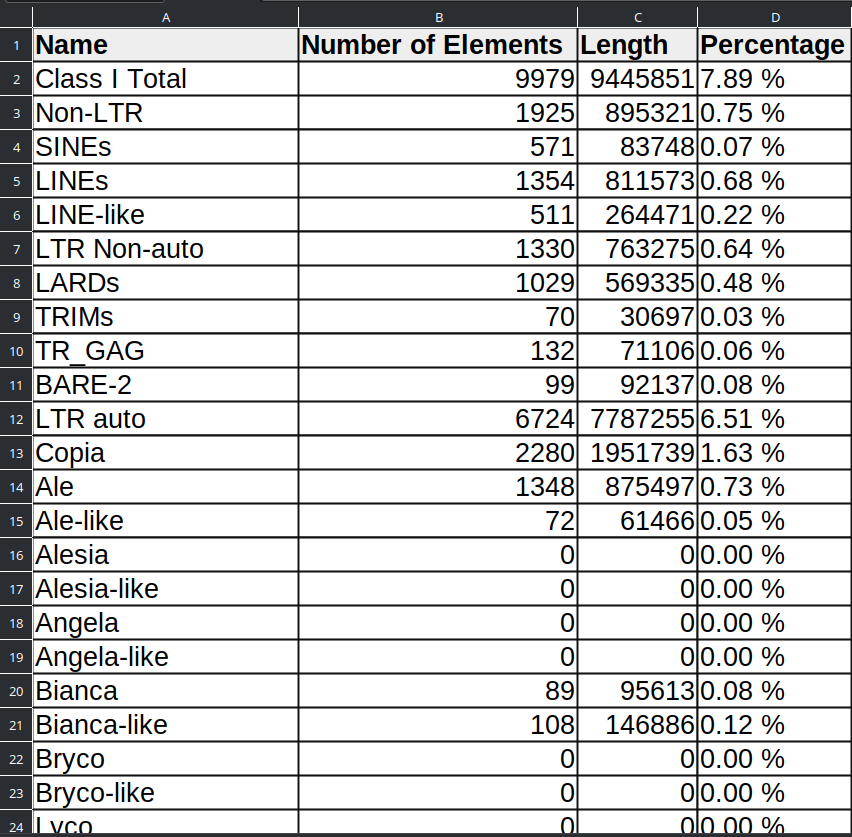
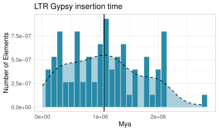
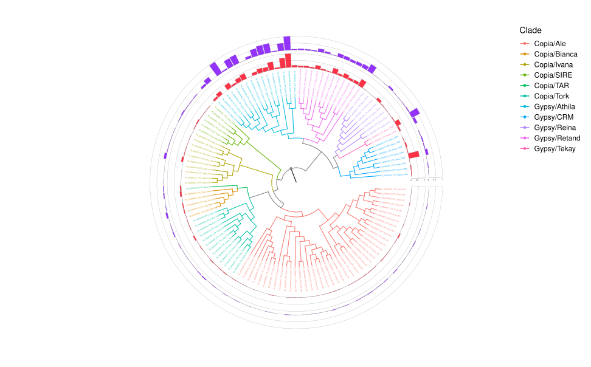

<div align="center"> 
    
</div><br>

<div align="center">

   
</div>


# AnnoTEP
AnnoTEP is a platform dedicated to the annotation of transposable elements (TEs) in plant genomes. Built on the [Plant genome Annotation](https://github.com/amvarani/Plant_Annotation_TEs) pipeline, it combines sophisticated annotation tools integrated with HTML resources to offer researchers an enhanced experience during the annotation process. By integrating these tools with a user-friendly interface, AnnoTEP aims to facilitate and optimize the work of TE annotation, providing an effective solution for plant genomic analysis.

AnnoTEP is currently available in three formats: Web Server, Home Server with Interface and Home Server Terminal. Clicking on each format below will take you to the system where you can access or install the platform:
- [Web Server](http://150.230.81.111:5000/) 
- [Home server with interface](#home-server-with-interface)
- [Home server in terminal](#home-server-in-terminal)

## Tool functions
* Identification, validation and annotation of SINE and LINE elements
* Genome masking (home server mode)
* Report generation on TEs
* Generation of graphs illustrating repeated elements
* Generation of age graphs for Gypsy and Copia elements
* Generation of phylogeny and TE density graphs
<br>

# Table of contents
* [Installation with Docker](#installation-with-docker)
    * [Home server with interface](#home-server-with-interface)
    * [Home server in terminal](#home-server-in-terminal)
* [Installation with Github](#installation-with-github)
    * [Organizing the environment](#organizing-the-environment)
    * [Results](#results)
    * [Running the platform with home server interface via github](#running-the-platform-with-home-server-interface-via-github)
    * [Running the platform without a home server interface via github](#running-the-platform-without-a-home-server-interface-via-github)
<br>

# Installation with Docker
AnnoTEP can be installed on the machine in different ways, one of which is using Docker. The tool is available in two formats: with a graphical interface and without an interface (terminal mode). To follow the steps below, you need to have Docker installed on your machine. You can download it directly from the official [Docker website](https://docs.docker.com/engine/install/)


## Home server with interface
**Important**: for this version your machine must have access to the internet network

Open the terminal and run the following commands:

**Step 1.** Download the AnnoTEP image:
```sh
docker pull annotep/graphic-interface:v1
```

**Step 2.** Next, run the container with the command below, specifying a folder to store the annotation results on your machine:
```sh
docker run -it -v {folder-results}:/root/TEs/www/results --name graphic-interface -dp 0.0.0.0:5000:5000 annotep/graphic-interface:v1
```

### Description:
- ``-v {folder-results}:/root/TEs/www/results``: This creates a volume between the host and the container to store data. You can replace ``-v {folder-results}`` with any folder path on your machine, if you don't have the folder created Docker will create it. ``/root/TEs/www/results`` is the path of the directory folder, you don't need to change it.
- ``--name graphic-interface``: Sets the name of the container to "graphic-interface".
- ``-dp 0.0.0.0:5000:5000``: Maps the container's port 5000 to the host's port 5000.
- ``annotep/graphic-interface:v1``: Specifies the image to be used.

#### Example:
```sh
docker run -it -v $HOME/Documents/results-annotep:/root/TEs/www/results --name graphic-interface -dp 0.0.0.0:5000:5000 annotep/graphic-interface:v1
```

**Step 3.** After running the container with the previous command, access the AnnoTEP interface by typing the following address into your web browser: 
``127.0.0.1:5000``

**Step 4.** When you access 127.0.0.1:5000 you will see a version of the AnnoTEP platform similar to the WEB version. 

**Step 5.** Within the interface you can enter your data such as: email, genome and annotation type and send it for analysis. When the work is completed without any errors, you will receive an e-mail informing you that the results are available in the directory entered in ``-v {folder}``.

Inside the directory you will find the following files:

- **SINE folder -** contains the data generated from the SINE annotation or full annotation.

- **LINE-results folder -** contains the data generated through LINE annotation or complete annotation. 

- **Complete-analysis folder -** obtained through the complete annotation, in this folder, in addition to the graphs, trees and tables generated, it brings elements masked by means of $genome-Softmasked.fa and the new structural annotations SINEs and LINEs, available in the folder $genome.EDTA.raw. ($genome = name of the genome worked on). Look for SINE.intact.fa, SINE.intact.gff3, LINE.intact.fa and LINE.intact.gff3, plus a final analysis of LINEs elements available in $genome.TElib.fa.lask 

[About the type of annotation](#type-annotation)

**Important2**: Avoid shutting down the machine during the process, as this could interrupt the data analysis. Even when using the web system, processing takes place locally on your machine.

**Important3**: Bear in mind that the speed of the annotation will depend on the performance of your local machine.

## Home server in terminal
**Step 1.** Download the AnnoTEP image:
```sh
docker pull annotep/bash-interface:v1
```

**Step 2.** Use the ``-h`` parameter to display a user guide describing how to use the script:

```sh
docker run annotep/bash-interface:v1 python run_annotep.py -h
```
- You will be introduced to:
```sh
usage: run_annotep.py [-h] --file FILE --type {1,2,3,4}

Run annotep with specified parameters.

optional arguments:
  -h, --help        show this help message and exit
  --file FILE       Genome file name (.fasta)
  --type {1,2,3,4}  Type annotation:
                     [1] SINE Annotation 
                     [2] LINE Annotation
                     [3] SINE and LINE annotation
                     [4] Complete Annotation
```

**Step 3.** To simplify this step, we recommend creating a folder where you can insert your genomic data in FASTA format. After creating the folder, run the container using the command below. Make sure you provide the full path to the folder where you want to save the results, as well as the full path to the folder containing the genomes:

```sh
docker run -it -v {folder-results}:/root/TEs/local/results -v /home/user/TEs:{folder-genomes} annotep/bash-interface:v1 python run_annotep.py --file {folder-genomes/genome.fasta} --type {type-annotation}
```

### Description:
- ``-v {folder-results}:/root/TEs/local/results``: This creates a volume between the host and the container to store data. You can replace ``-v {folder-results}`` with any folder path on your machine where you want to save the results, if you don't have the folder created Docker will create it. ``/root/TEs/www/results`` is the directory folder path, you don't need to change it.
- ``-v /home/user/TEs:{folder-genomes}``: It is responsible for creating a temporary copy of the genomic files inside Docker, which is why you must enter the correct address of the folder that stores the genomes in ``{folder-genomes}``.
- ``--file {folder-genomes/genome.fasta}``: Here you must enter the correct address of the folder that stores the genomes along with the name of the genome you want to annotate.
- ``--type {type-annotation}``: Type of annotation shown in step 2

#### Example:
```sh
docker run -it -v $HOME/results-annotep:/root/TEs/local/results -v $HOME/TEs:$HOME/TEs/genomes annotep/bash-interface:v1 python run_annotep.py --file $HOME/TEs/genomes/Arabidopsis_thaliana.fasta --type 2
```

**Step 4.** Now wait for the genome annotation to be completed by following the analysis through the terminal
<br>

# Installation with Github
 * The installation guide to be presented was adapted from [Plant genome Annotation](https://github.com/amvarani/Plant_Annotation_TEs), with some modifications throughout the code. 
 * **Plant Genome Annotation** uses modified code from the [AnnoSINE](https://github.com/baozg/AnnoSINE), [MGEScan-non-LTR](https://github.com/MGEScan), [TEsorter](https://github.com/zhangrengang/TEsorter) and [EDTA](https://github.com/oushujun/EDTA) pipelines.

## Prerequisites
- [Python 3.7+](https://www.python.org/)

- [Miniconda3](https://docs.conda.io/projects/miniconda/en/latest/)

- System Ubuntu

## Download the repository
**Step 1.** In the terminal run:
```sh
git clone https://github.com/Marcos-Fernando/AnnoTEP.git $HOME/TEs
```

**Step 2.** Access the repository location on the machine:
```sh
cd $HOME/TEs
```

## Configuring the repository
### Libraries
**Step 1.** In the terminal download the following libraries:
```sh
sudo apt-get install lib32z1 python-is-python3 python3-setuptools python3-biopython python3-xopen trf hmmer2 seqtk
sudo apt-get install hmmer emboss python3-virtualenv python2 python2-setuptools-whl python2-pip-whl cd-hit iqtree
sudo apt-get install python2-dev build-essential linux-generic libmpich-dev libopenmpi-dev bedtools pullseq bioperl
sudo apt-get install pdf2svg

# R dependencies
sudo apt-get install r-cran-ggplot2 r-cran-tidyr r-cran-reshape2 r-cran-reshape rs r-cran-viridis r-cran-tidyverse r-cran-gridextra r-cran-gdtools r-cran-phangorn r-cran-phytools r-cran-ggrepel
```
Access the R program from the terminal and install libraries from within it:
```sh
R

install.packages("hrbrthemes")

if (!require("BiocManager", quietly = TRUE))
    install.packages("BiocManager")
BiocManager::install("ggtree")
BiocManager::install("ggtreeExtra")
```

**Step 2.** After installing the libraries, copy the ``irf`` and ``break_fasta.pl`` scripts to local/bin on your machine:
```sh
sudo cp Scripts/irf /usr/local/bin
sudo cp Scripts/break_fasta.pl /usr/local/bin
```

**Step 3.** Then configure the TEsorter:
```sh
cd $HOME/TEs/TEsorter
sudo python3 setup.py install
```

Check the version of python on the machine to proceed with the configuration
* Python 3.7
```sh
cd /usr/local/lib/python3.7/dist-packages/TEsorter-1.4.1-py3.6.egg/TEsorter/database/
```

* Python 3.10
```sh
cd /usr/local/lib/python3.10/dist-packages/TEsorter-1.4.1-py3.10.egg/TEsorter/database/
```
...

```sh
sudo hmmpress REXdb_v3_TIR.hmm
sudo hmmpress Yuan_and_Wessler.PNAS.TIR.hmm
sudo hmmpress REXdb_protein_database_viridiplantae_v3.0_plus_metazoa_v3.hmm
sudo hmmpress REXdb_protein_database_viridiplantae_v3.0.hmm
sudo hmmpress REXdb_protein_database_metazoa_v3.hmm
sudo hmmpress Kapitonov_et_al.GENE.LINE.hmm
sudo hmmpress GyDB2.hmm
sudo hmmpress AnnoSINE.hmm
cd $HOME/TEs 
```
### Downloading genomes for testing
At this stage you can choose to use your data or download some examples for testing:
* _Theobrama cacao_
```sh
wget https://cocoa-genome-hub.southgreen.fr/sites/cocoa-genome-hub.southgreen.fr/files/download/Theobroma_cacao_pseudochromosome_v1.0_tot.fna.tar.gz
tar xvfz Theobroma_cacao_pseudochromosome_v1.0_tot.fna.tar.gz
mv Theobroma_cacao_pseudochromosome_v1.0_tot.fna Tcacao.fasta
rm Theobroma_cacao_pseudochromosome_v1.0_tot.fna.tar.gz
```

* _Arabidopsis thaliana_ 
```sh
wget https://www.arabidopsis.org/download_files/Genes/TAIR10_genome_release/TAIR10_chromosome_files/TAIR10_chr_all.fas.gz
gzip -d TAIR10_chr_all.fas.gz
cat TAIR10_chr_all.fas | cut -f 1 -d" " > At.fasta
rm TAIR10_chr_all.fas
```

## Organizing the environment
### Configuring the modified AnnoSINE
**Step 1.** Create and activate the AnnoSINE conda environment:
```sh
cd SINE/AnnoSINE/
conda env create -f AnnoSINE.conda.yaml

cd bin
conda activate AnnoSINE
```

**Step 2.** Run the test data (chromosome 4 of A. thaliana) to verify the installation:
```sh
python3 AnnoSINE.py 3 ../Testing/A.thaliana_Chr4.fasta ../Output_Files
```
- A file 'Seed_SINE.fa' will be created in '../Output_Files'. This file contains all the planned SINE elements and will be used later in the next steps.

We are now ready to annotate the SINE elements of your genome project file.

**Step 3.** In this example we will run the preloaded _A. thaliana_ genome or its data
```sh
python3 AnnoSINE.py 3 $HOME/TEs/At.fasta At
cp ./Output_Files/Seed_SINE.fa $HOME/TEs/At-Seed_SINE.fa
```

- Deactivate the environment
```sh
conda deactivate
cd $HOME/TEs
```
### Setting up MGEScan-non-LTR and primary validation with TEsorter
**Step 1.** Enter the Non-LTR folder and create a virtual environment
```sh
cd non-LTR/mgescan/

virtualenv -p /usr/bin/python2 mgescan-virtualenv
source mgescan-virtualenv/bin/activate
pip2 install biopython==1.76
pip2 install bcbio-gff==0.6.6
pip2 install docopt==0.6.1
python setup.py install
```

Follow the instructions on the installer screens.
If you are unsure about any settings, accept the defaults.

mgescan is now installed and ready to work. Test the installation:
```sh
mgescan --help
```
### Configuring environment variables:
**Step 1.** Have vim installed on your machine, in the terminal type:
```sh
vim ~/.bashrc
```
A window with instructions will open, drag to the last line of the document and press the letter ``i`` to activate edit mode and type the PATH command:
```sh
export PATH="$HOME/miniconda3/envs/AnnoSINE/bin:$PATH";
export PATH="$HOME/miniconda3/envs/EDTA/bin:$PATH";
export PATH="$HOME/TEs/non-LTR/hmmer-3.2/src/:$PATH";
```
When finished, press the ``ESC`` button to end the editing mode, type ``:wq`` and press ``ENTER`` to save the changes and close the document.

After making the changes, restart the terminal (or close the terminal and open it again)

**Step 2.** In the terminal, run (only once):
```sh
cd ..
cd hmmer-3.2
make clean
./configure
make -j
```
Now we can run MGEScan-non-LTR, in the terminal configure the directories:
```sh
cd $HOME/TEs/non-LTR
mkdir At-LINE
cd At-LINE
ln -s $HOME/TEs/At.fasta At.fasta
cd ..

# Set the ulimit higher value - See below
ulimit -n 8192
```

**Step 3.** Run MGEScan-non-LTR
```sh
mgescan nonltr $HOME/TEs/non-LTR/At-LINE --output=$HOME/TEs/non-LTR/At-LINE-results --mpi=4
```

**Step 4.** Removing false positives with TEsorter and generating the pre-final non-redundant LINE library showing compatible input for the modified EDTA pipeline:
```sh
cd At-LINE-results
```

**Step 5.** Run the following command to generate the non-redundant LINE-lib.fa file:
```sh
cat info/full/*/*.dna > temp.fa
cat temp.fa | grep \>  | sed 's#>#cat ./info/nonltr.gff3 | grep "#g'  | sed 's#$#" | cut -f 1,4,5#g'  > ver.sh
bash ver.sh  | sed 's#\t#:#' | sed 's#\t#\.\.#'   > list.txt

mkdir TMP
break_fasta.pl < temp.fa TMP/
cat temp.fa | grep \> | sed 's#>#cat ./TMP/#g' | sed 's#$#.fasta#g' > A.txt
cat temp.fa | grep \> > list2.txt
paste list2.txt list.txt | sed 's/>/ sed "s#/g'  | sed 's/\t/#/g' | sed 's/$/#g"/g'   > B.txt
paste A.txt B.txt  -d"|"  > rename.sh
bash rename.sh > candidates.fa

/usr/local/bin/TEsorter -db rexdb-plant --hmm-database rexdb-plant -pre LINE -p 22 -cov 80 -eval 0.0001 -rule 80-80-80 candidates.fa
more LINE.cls.lib  | sed 's/#/__/g'  | sed 's#.fa##g' | cut -f 1 -d" " | sed 's#/#-#g'  > pre1.fa
mkdir pre1
break_fasta.pl < pre1.fa pre1
cat pre1/*LINE.fasta  | sed 's#__#\t#g' | cut -f 1  > pre2.fa

/usr/local/bin/TEsorter -db rexdb-line --hmm-database rexdb-line -pre LINE2 -p 22 -cov 60 -eval 0.0001 -rule 80-80-80 pre2.fa
more LINE2.cls.lib  | sed 's/#/__/g'  | sed 's#.fa##g' | cut -f 1 -d" " | sed 's#/#-#g'  > pre-final.fa
mkdir pre-final
break_fasta.pl < pre-final.fa pre-final
cat pre-final/*LINE*.fasta  > pre-final2.fa
cdhit-est -i pre-final2.fa -o clustered -c 0.8 -G 1 -T 22 -d 100 -s 0.6 -aL 0.6 -aS 0.6
cat clustered | sed 's/__/#/g' | sed 's#-#/#g'  > LINE-lib.fa
#
rm -rf pre1/ pre-final/ TMP/
rm LINE2*
rm LINE.cls.*
rm A.txt B.txt clustered.clstr clustered LINE.dom* list2.txt list.txt pre1.fa pre2.fa pre-final2.fa pre-final.fa rename.sh temp.fa ver.sh candidates.fa
cp LINE-lib.fa $HOME/TEs/At-LINE-lib.fa 
```

- Deactivate the environment and return to the pipeline home screen:
```sh
deactivate
cd $HOME/TEs
```

### Configuring modified EDTA
**Step 1.** Install and activate the EDTA conda environment:
```sh
cd EDTA
bash
```

```sh
conda env create -f EDTA.yml
conda activate EDTA

perl EDTA.pl
```

**Step 2.** Now let's use the ``At-LINE-lib.fa`` and ``At-Seed_SINE.fa`` files generated in the previous steps:
```sh
cd ..
mkdir Athaliana
cd Athaliana

nohup $HOME/TEs/EDTA/EDTA.pl --genome ../At.fasta --species others --step all --line ../At-LINE-lib.fa --sine ../At-Seed_SINE.fa --sensitive 1 --anno 1 --threads 10 > EDTA.log 2>&1 &
```

**Step 3.** Track progress by:
```sh
tail -f EDTA.log
```

**Notes:**

**1.** Set the number of threads available on your computer or server. Set the maximum available. In our code it is set to 10.

**2.** For more accurate TE detection and annotation, activate the "sensitive" flag. This will activate the RepeatModeler to identify remaining TEs and other repeats. The RepeatModeler step will also generate the Superfamily and Lineage TE classification and can capture other unknown LINEs and repeats. Our modified EDTA pipeline will do this automatically. This step is strongly recommended.

**3.** The SINE and LINE structural annotations are available in the $genome.EDTA.raw folder. Look for SINE.intact.fa, SINE.intact.gff3, LINE.intact.fa and LINE.intact.gff3

**4.** The final LINE library is embedded in the TElib.fa file. So if you want to recover all the LINEs, use this file.
<br>

---
### Smooth masking
Generally, non-autonomous elements can carry passenger genes (for example, non-autonomous LARDs and Helitrons). Therefore, for proper annotation of the genome, these elements must be partially masked. The modified EDTA pipeline will take care of this automatically and generate a suitably masked genome sequence for structural gene annotation. The softmasked genome sequence is available in the EDTA folder, with the name $genome-Softmasked.fa .

---
<br>

# Results
## Generating reports
Still in the EDTA environment run:
```sh
cd $HOME/TEs
cd Athaliana
mkdir TE-REPORT
cd TE-REPORT
ln -s ../At.fasta.mod.EDTA.anno/At.fasta.mod.cat.gz .

perl $HOME/TEs/ProcessRepeats/ProcessRepeats-complete.pl -species viridiplantae -nolow -noint At.fasta.mod.cat.gz
mv At.fasta.mod.tbl ../TEs-Report-Complete.txt

cd ..
python $HOME/TEs/Scripts/convert-table.py
```

The results obtained are: ``TEs-Report-Complete.csv`` and ``TEs-Report-Complete.txt``.



- In this report, the partial elements will be named with the suffix "-like" (e.g. Angela-like)

To generate a simpler report, repeat the above process using the ProcessRepeats-lite.pl script, the result will be ``TEs-Report-lite.txt``:
```sh
perl $HOME/TEs/ProcessRepeats/ProcessRepeats-lite.pl -species viridiplantae -nolow -noint -a At.fasta.mod.cat.gz

mv At.fasta.mod.tbl ../TEs-Report-lite.txt
```

## Repeated landscape graphs
The landscape repeat graph is a reasonable inference of the relative ages of each element identified in a given genome.

In the terminal, run:
```sh
cd $HOME/TEs
cd Athaliana
cd TE-REPORT

cat At.fasta.mod.align  | sed 's#TIR/.\+ #TIR &#g'  | sed 's#DNA/Helitron.\+ #Helitron &#g' | sed 's#LTR/Copia.\+ #LTR/Copia &#g' | sed 's#LTR/Gypsy.\+ #LTR/Gypsy &#g'  | sed 's#LINE-like#LINE#g' | sed 's#TR_GAG/Copia.\+ #LTR/Copia &#g' | sed 's#TR_GAG/Gypsy.\+ #LTR/Gypsy &#g' | sed 's#TRBARE-2/Copia.\+ #LTR/Copia &#g' | sed 's#BARE-2/Gypsy.\+ #LTR/Gypsy &#g' | sed 's#LINE/.\+ #LINE &#g' > tmp.txt
#

cat tmp.txt  | grep "^[0-9]"  -B 6 |  grep -v "\-\-"  | grep "LTR/Copia" -A 5 |  grep -v "\-\-"  > align2.txt
cat tmp.txt  | grep "^[0-9]"  -B 6 |  grep -v "\-\-"  | grep "LTR/Gypsy" -A 5 |  grep -v "\-\-"  >> align2.txt
cat tmp.txt  | grep "^[0-9]"  -B 6 |  grep -v "\-\-"  | grep "TIR" -A 5 |  grep -v "\-\-"  >> align2.txt
cat tmp.txt  | grep "^[0-9]"  -B 6 |  grep -v "\-\-"  | grep "LINE" -A 5 |  grep -v "\-\-"  >> align2.txt
cat tmp.txt  | grep "^[0-9]"  -B 6 |  grep -v "\-\-"  | grep "LARD" -A 5 |  grep -v "\-\-"  >> align2.txt
cat tmp.txt  | grep "^[0-9]"  -B 6 |  grep -v "\-\-"  | grep "TRIM" -A 5 |  grep -v "\-\-"  >> align2.txt
cat tmp.txt  | grep "^[0-9]"  -B 6 |  grep -v "\-\-"  | grep "Helitron" -A 5 |  grep -v "\-\-"  >> align2.txt
cat tmp.txt  | grep "^[0-9]"  -B 6 |  grep -v "\-\-"  | grep "SINE" -A 5 |  grep -v "\-\-"  >> align2.txt
cat tmp.txt  | grep "^[0-9]"  -B 6 |  grep -v "\-\-"  | grep "Unknown" -A 5 |  grep -v "\-\-"  >> align2.txt
#

perl $HOME/TEs/ProcessRepeats/calcDivergenceFromAlign.pl -s At.divsum align2.txt

genome_size="`perl $HOME/TEs/EDTA/util/count_base.pl ../At.fasta.mod | cut -f 2`" 
perl $HOME/TEs/ProcessRepeats/createRepeatLandscape.pl -g $genome_size -div At.divsum > ../RepeatLandscape.html

tail -n 72 At.divsum > divsum.txt

cat $HOME/TEs/Rscripts/plotKimura.R | sed "s#_SIZE_GEN_#$genome_size#g" > plotKimura.R

Rscript plotKimura.R
mv Rplots.pdf ../RepeatLandScape.pdf

rm align2.txt
rm tmp.txt

cd ..
pdf2svg RepeatLandScape.pdf RLandScape.svg
```

The graphics obtained will be: ``RepeatLandScape.pdf`` and ``RLandScape.svg``.


### LTR age plot (Gypsy and Copia)
To plot the ages of the LTR Gypsy and LTR Copia elements, we will use a ggplot2 Rscript.
```sh
cd $HOME/TEs
cd Athaliana
mkdir LTR-AGE
cd LTR-AGE
ln -s ../At.fasta.mod.EDTA.raw/At.fasta.mod.LTR-AGE.pass.list .

ln -s $HOME/TEs/Rscripts/plot-AGE-Gypsy.R .
ln -s $HOME/TEs/Rscripts/plot-AGE-Copia.R .

cat -n At.fasta.mod.LTR-AGE.pass.list  | grep Gypsy  | cut -f 1,13 | sed 's# ##g'  | sed 's#^#Cluster_#g' | awk '{if ($2 > 0) print $n}'   > AGE-Gypsy.txt
cat -n At.fasta.mod.LTR-AGE.pass.list  | grep Copia  | cut -f 1,13 | sed 's# ##g'  | sed 's#^#Cluster_#g' | awk '{if ($2 > 0) print $n}'   > AGE-Copia.txt

Rscript plot-AGE-Gypsy.R
Rscript plot-AGE-Copia.R

pdf2svg AGE-Copia.pdf AGE-Copia.svg
pdf2svg AGE-Gypsy.pdf AGE-Gypsy.svg
```
The final files are: ``AGE-Copia.pdf``, ``AGE-Gypsys.pdf``, ``AGE-Copia.svg`` and ``AGE-Gypsy.svg``.




### Plotting LTR elements Phylogeny and Density
Plotting the phylogeny of the alignments of all the LTR-RT domains.
```sh
cd $HOME/TEs
cd Athaliana
mkdir TREE
cd TREE

ln -s ../At.fasta.mod.EDTA.TElib.fa .
cat At.fasta.mod.EDTA.TElib.fa | sed 's/#/_CERC_/g'  | sed 's#/#_BARRA_#g'  > tmp.txt

mkdir tmp
break_fasta.pl < tmp.txt ./tmp
cat tmp/*LTR* | sed 's#_CERC_#\t#g' | cut -f 1 > TE.fasta
rm -f tmp.txt ; rm -f At.fasta.mod.EDTA.TElib.fa ; rm -Rf tmp

/usr/local/bin/TEsorter -db rexdb-plant --hmm-database rexdb-plant -pre TE -dp2 -p 40 TE.fasta

concatenate_domains.py TE.cls.pep GAG > GAG.aln
concatenate_domains.py TE.cls.pep PROT > PROT.aln
concatenate_domains.py TE.cls.pep RH > RH.aln
concatenate_domains.py TE.cls.pep RT > RT.aln
concatenate_domains.py TE.cls.pep INT > INT.aln

cat GAG.aln | cut -f 1 -d" " > GAG.fas
cat PROT.aln | cut -f 1 -d" " > PROT.fas
cat RH.aln | cut -f 1 -d" " > RH.fas
cat RT.aln | cut -f 1 -d" " > RT.fas
cat INT.aln | cut -f 1 -d" " > INT.fas

perl $HOME/TEs/Scripts/catfasta2phyml.pl -c -f *.fas > all.fas
iqtree2 -s all.fas -alrt 1000 -bb 1000 -nt AUTO 

cat TE.cls.tsv | cut -f 1 | sed "s#^#cat ../At.fasta.mod.EDTA.TEanno.sum | grep -w \"#g"  | sed 's#$#"#g'   > pick-occur.sh
bash pick-occur.sh  > occur.txt

cat occur.txt  | sed 's#^      TE_#TE_#g'  | awk '{print $1,$2,$3}' | sed 's# #\t#g' |  sort -k 2 -V  > sort_occur.txt
cat occur.txt  | sed 's#^      TE_#TE_#g'  | awk '{print $1,$2,$3}' | sed 's# #\t#g' |  sort -k 3 -V  > sort_size.txt
cat all.fas  | grep \> | sed 's#^>##g'   > ids.txt

cat sort_occur.txt | cut -f 1,2 | sed 's#^#id="#g' | sed 's#\t#" ; data="#g' | sed 's#$#" ; ver="`cat ids.txt | grep $id`" ; echo -e "$ver\\t$data" #g'   > pick.sh
bash pick.sh  | grep "^TE" | grep "^TE"  | sed 's/#/_/g' | sed 's#/#_#g'  > occurrences.tsv

cat sort_size.txt | cut -f 1,3 | sed 's#^#id="#g' | sed 's#\t#" ; data="#g' | sed 's#$#" ; ver="`cat ids.txt | grep $id`" ; echo -e "$ver\\t$data" #g'   > pick.sh
bash pick.sh  | grep "^TE" | grep "^TE"  | sed 's/#/_/g' | sed 's#/#_#g'  > size.tsv

rm -f pick-occur.sh sort_occur.txt sort_size.txt ids.txt pick.sh

ln -s $HOME/TEs/Rscripts/LTR_tree.R .
ln -s $HOME/TEs/Rscripts/LTR_tree-density.R .

Rscript LTR_tree.R all.fas.contree TE.cls.tsv LTR_RT-Tree1.pdf
Rscript LTR_tree-density.R all.fas.contree TE.cls.tsv occurrences.tsv size.tsv LTR_RT-Tree2.pdf

pdf2svg LTR_RT-Tree1.pdf LTR_RT-Tree1.svg
pdf2svg LTR_RT-Tree2.pdf LTR_RT-Tree2.svg
```
The files generated will be: ``LTR_RT-Tree1.pdf``, ``LTR_RT-Tree2.pdf``, ``LTR_RT-Tree1.svg`` and ``LTR_RT-Tree2.svg``.




- The outer circle (purple) represents the length (in bp) occupied by each element, while the inner circle (red) represents the number of occurrences of each element.

<br>

# Running the platform with home server interface via github
**Step 1.** Access the "desktop" folder and create a Python virtual environment by running the following commands in your terminal. Make sure you have done the [environment setup](#organizing-theenvironment) before proceeding.
```sh
cd $HOME/TEs/desktop
python3 -m venv .venv

. .venv/bin/activate
```

**Step 2:** Install the packages needed for the application by running the following command (this only needs to be done once):
```sh
pip install -r ../required.txt 
```
- Inside the ``required.txt`` file, you'll find the fundamental libraries, such as Flask and python-dotenv. If any package shows an error, you'll need to install it manually.

**Step 3:** Now, inside the "desktop" folder and with the virtual environment activated, run the following command to start the application:
```sh
flask run
```

If all the settings are correct, you will see a message similar to this one:
```sh
 * Serving Flask app 'main.py' (lazy loading)
 * Environment: development
 * Debug mode: on
 * Running on http://127.0.0.1:5000/ (Press CTRL+C to quit)
 * Restarting with stat
 * Debugger is active!
 * Debugger PIN: 264-075-516
```

**Step 4.** Click on the link http://127.0.0.1:5000/ or copy and paste it into your browser to access the platform and start testing it.
<br>

# Running the platform without a home server interface via github
- This mode is entirely command-line based, so there's no need to create a development environment. Make sure you have done the [environment setup](#organizing-theenvironment) before proceeding.

**Step 1.** Go to the "local" folder and run the ``run_annotep.py`` script by typing the following command:
```sh
python run_annotep.py -h
```

- The ``-h`` parameter displays a user guide describing how to use the script:
```sh
usage: run_annotep.py [-h] --file FILE --type {1,2,3,4}

Run annotep with specified parameters.

optional arguments:
  -h, --help        show this help message and exit
  --file FILE       Genome file name (.fasta)
  --type {1,2,3,4}  Type annotation:
                     [1] SINE Annotation 
                     [2] LINE Annotation
                     [3] SINE and LINE annotation
                     [4] Complete Annotation
```

**Step 2:** Run the command adding the full path of the directory containing the genome and the type of annotation you want:
```sh
python run_annotep.py --file $HOME/TEs/At.fasta --type 2
```

<br>

# Type Annotation
The annotation system allows you to make four different types of annotations:
- **Selecting SINE Annotation:** This option exclusively analyzes the SINE elements present in the plant genome, generating libraries containing specific SINE sequences.

- **Selecting LINE Annotation:** This option exclusively analyzes the LINE elements present in the plant genome, generating libraries containing specific LINE sequences.

- **Selecting SINE and LINE Annotation (Together):** This choice leads to the joint analysis of SINEs and LINEs elements in the plant genome, generating libraries containing sequences from both categories.

- **Selecting Complete Annotation:** This option performs a comprehensive analysis of the SINEs and LINEs elements, including an in-depth analysis using libraries of both elements. In addition to the conventional outputs, such as tables of TRIM, LARD, TR_GAG, BARE-2, MITES, Helitron, Gypsy Family and Copia Family elements, age graphs are generated for the Gypsy and Copia families, as well as a phylogenetic tree.