<div align="center"> 
    
</div><br>

<div align="center">

           
</div>

# Table of contents
* [Introduction](#introduction)
* [Installing AnnoTEP](#installing-annotep)
* [Installing with library and conda](#installing-with-library-and-conda)
    * [Testing](#testing)
    * [Generating Graphs](#generating-graphs)
    * [Using AnnoTEP with graphical user interface](#using-annotep-with-graphical-user-interface)
* [Installing with Container](#installing-with-container)
    * [Docker](#docker)
        * [Graphic User Interface - GUI](#graphic-user-interface---gui)
        * [Command Line Interface - CLI](#command-line-interface---cli)
    * [Singularity](#singularity)
        * [GUI](#gui)
        * [CLI](#cli)
* [Results](#results)
* [List of genomes tested in this pipeline](#list-of-genomes-tested-in-this-pipeline)
* [Citations](#citations)
* [Questions and Issues](#questions-and-issues)
<br>

# Introduction
The AnnoTEP is a platform designed for the annotation of transposable elements (TEs) in plant genomes. Built upon the [EDTA pipeline](https://github.com/oushujun/EDTA), the tool incorporates specific modifications inspired by the [Plant genome Annotation pipeline](https://github.com/amvarani/Plant_Annotation_TEs), as well as adjustments that enhance its performance and flexibility. One of the key differentiators of AnnoTEP is its graphical user interface (GUI), developed using HTML and Python technologies, which makes the process accessible even to researchers with limited familiarity with command-line operations. Combining efficiency, customisation, and ease of use, AnnoTEP provides a robust solution for the analysis and annotation of TEs. Additionally, the tool has proven effective in the analysis of algae and microalgae, contributing to significant advancements in genomic research.

In addition to its GitHub repository, AnnoTEP also has a [website](https://plantgenomics.ncc.unesp.br/AnnoTEP/) that centralises its documentation, displays the genome mutation rate table, and showcases a selection of pre-processed genomes using the tool.

### Functions of AnnoTEP
* Enhancement in the detection of LTRs, LINEs, TIRs, and Helitrons.
* Improved identification and classification of non-autonomous LTRs, such as TRIM, LARD, TR-GAG, and BARE2.
* Detection of solo LTRs.
* Classification of lineages belonging to the Copia and Gypsy superfamilies.
* Classification of Helitrons into autonomous and non-autonomous.
* Optimisation of repetitive sequence masking.
* Generation of TE classification reports.
* Creation of repeat landscape plots, histograms, and phylogenetic trees of LTR lineages.

<br>

# Installing AnnoTEP
AnnoTEP can be installed in different ways, depending on your preferences and needs. In this tutorial, we will guide you through two main installation methods: the traditional method and installation via Docker. Both methods are detailed to ensure a smooth and efficient setup on your machine.

>[!IMPORTANT]
> <b> System requirements </b> <br>
> 💾 <b>Software</b>
> - 🖥️ System Ubuntu (20.04.6 LTS, 22.04.4 LTS)
> - 📦 [Miniconda3](https://docs.conda.io/projects/miniconda/en/latest/) 
>
> 💻 <b> Hardware </b> <br>
> Minimum requirements for Genomes up to <b>1GB</b> 
> * <b>Threads:</b> 20
> * <b> RAM: </b> 50GB
> * <b> Storage: </b> 1TB 
> 
> ⚠️ Higher computational resources are strongly recommended for larger genomes.

**Step 1.** In terminal, Download the repository
```sh 
git clone https://github.com/Marcos-Fernando/AnnoTEP.git $HOME/AnnoTEP
```

**Step 2.** Enter into the folder
```sh 
cd $HOME/AnnoTEP
```

##  Installing with library and conda

> [!TIP]
> **Installing Miniconda**
><br>
> * Download [Miniconda3](https://docs.conda.io/projects/miniconda/en/latest/)
> * After downloading Miniconda from the link above, run the following command in your terminal:
> ```sh
> bash Miniconda3-latest-Linux-x86_64.sh
> ```

📌 Once Miniconda is installed, make sure you are inside the <b>AnnoTEP directory</b>, then set up the environment as follows:
```sh
cd $HOME/AnnoTEP

conda env create -f environment.yml
conda activate EDTA-new
```

📌  Still within the <b>AnnoTEP directory</b>, copy the ```break_fasta.pl``` script to ```/usr/local/bin``` to make it accessible system-wide:
```sh
sudo cp Scripts/break_fasta.pl /usr/local/bin
```


> [!IMPORTANT]
> 📌 <b> RepeatMasker Fixes for Long Names </b> <br>
>
> During execution, you may encounter the following error: ``` FastaDB::_cleanIndexAndCompact(): Fasta file contains a sequence identifier which is too long ( max id length = 50 )```
> 
> To fix this issue, follow the steps below:
> <br>
> **Step 1.** Edit the **RepeatMasker File**
> * Access the RepeatMasker file installed in the Conda environment:
>   ```sh
>   /home/"user"/miniconda3/envs/EDTA-new/bin/RepeatMasker
>   ``` 
>
> * Locate all occurrences of ``FastaDB`` where the following snippet appears:
>   ``` sh
>    = FastaDB->new(
>                  
>                   maxIDLength => 50
>   );
>   ``` 
> * Change the value of ``maxIDLength`` from ``50`` to a higher value, for example:
>   ``` sh
>    = FastaDB->new(
>                   
>                   maxIDLength => 80
>    );
>    ```
>
> **Step 2.** Edit the **ProcessRepeats File**
> * Acess the ``ProcessRepeats`` file:
>
>   ```sh
>   /home/"user"/miniconda3/envs/EDTA-new/share/RepeatMasker/ProcessRepeats
>   ``` 
> * Repeat the same procedure to change the value of  ``maxIDLength`` to ``80``.
>

## Testing 
**Step 1.** Download the genome <br>

🧬 _Arabidopsis thaliana_ 
* Download the TAIR10_chr_all.fas.gz file from the [TAIR](https://www.arabidopsis.org/download/list?dir=Genes%2FTAIR10_genome_release%2FTAIR10_chromosome_files) website and extract its contents.

```sh
gzip -d TAIR10_chr_all.fas.gz
cat TAIR10_chr_all.fas | cut -f 1 -d" " > At.fasta
rm TAIR10_chr_all.fas
```

**Step 2.** Inside the AnnoTEP directory, run EDTA on the downloaded genome
```sh
cd AnnoTEP
mkdir Athaliana
cd Athaliana

nohup ../EDTA/EDTA.pl --genome ../At.fasta --species others --step all --sensitive 1 --anno 1 --threads 20 -u 7.0e-9 > EDTA.log 2>&1 &
```

**Step 3.** Monitor the progress
```sh
tail -f EDTA.log
```

> [!TIP]
>
> 📌 <b>Adjust the number of threads - </b>  Set the number of threads ``--threads`` according to the capacity of your machine or server. For optimal performance, use the maximum available. In the example above, it is set to 20.
> <br>
> 📌 <b> Improving TE detection - </b> Enable ``--sensitive 1``. for more accurate TE detection and annotation. This option runs RepeatModeler to identify additional TEs and repeat sequences, and it also provides Superfamily and Lineage-level classifications.
> <br>
> 📌 <b>Enhancing genome analysis with mutation rate - </b> For a more refined analysis of TE insertion age, we recommend setting the mutation rate using the ``-u <float>``parameter. Suggested values and detailed explanations can be found in the ``LTR-Ages.doc`` file or in the Genome section of the [AnnoTEP](https://plantgenomics.ncc.unesp.br/AnnoTEP/). <br>
> 


> [!NOTE]
> Non-autonomous elements (e.g., non-autonomous LARDs and Helitrons) can carry passenger genes. For proper genome annotation, these elements must be partially masked. The modified EDTA pipeline handles this automatically and generates a softmasked genome sequence, available in the EDTA folder as ``$genome-Softmasked.fa`` .

## Generating Graphs
**Step 1. Run the processing script:** With the Conda environment still activated, navigate to the folder where the annotated genome was stored (e.g., Athaliana) and run the script below to generate summary data and graphs from the input genome (e.g., At.fasta):
 ```sh
cd Athaliana
bash -u ../Scripts/generate_PLOTs-for-TE-pipe.sh At.fasta
```

> [!TIP]
> Make sure to replace ``At.fasta`` with the name of the input genome file you wish to process, if it is different.

At the end of the analysis, a directory named REPORT will be created. It contains all the outputs, including bubble and bar plots, phylogenetic trees, and summary reports. Each of these results is described in detail in the [results section](#results).

📎 Return to [Table of contents](#table-of-contents)


# Using AnnoTEP with Graphical User Interface
The graphical interface of AnnoTEP has been designed with a focus on accessibility and precise user control throughout the TE annotation process. It follows user-centred design principles adapted to the field of bioinformatics, and leverages the parameters already defined by ``EDTA``. <br>

The interface architecture prioritises continuous user supervision during execution, offering an optional ``email notification system``. When enabled, AnnoTEP automatically sends updates regarding the start and completion of analyses, as well as any errors encountered. <br>

In addition, regardless of whether the email system is active, the interface provides an ``integrated results dashboard``, allowing real-time and dynamic visualisation of annotations in progress or already completed.

> [!IMPORTANT]
> Before proceeding, make sure the Conda environment is properly set up and activated.

**Step 1.** Navigate to the ``gui folder`` within the AnnoTEP directory.
```sh
cd AnnoTEP/gui
```

**Step 2. Configure flaskenv:** With the Conda environment active, navigate to the ``gui folder``. Inside this folder, you can create a ``.flaskenv`` file, which defines essential Flask settings and can optionally enable the email notification feature.
```sh
cd $HOME/AnnoTEP/gui
```

* You can create the ``.flaskenv`` file using the following content:
```sh
FLASK_APP = "main.py"
FLASK_DEBUG = True
FLASK_ENV = development
```

📌 **Email:** The interface architecture is designed to ensure continuous user monitoring during execution by offering an <b>optional</b> ``email notification system``. When enabled, AnnoTEP automatically sends updates about the start and completion of analyses, as well as any errors that may occur.
* If you plan to use the built-in email system (for notifications), you should also include the following configuration in your ``.flaskenv`` file:

```sh
MAIL_SERVER=server-email
MAIL_PORT=number
MAIL_USE_TLS=True or False
MAIL_USE_SSL=True or False
MAIL_USERNAME=your@email.com
MAIL_PASSWORD=app*password*
```
> [!TIP]
> <b> Email Server Settings: </b>
> * Gmail:
>   * Server: smtp.gmail.com 
>   * Port: 587 (TLS) or 465 (SSL) 
> * Outlook: 
>   * Server: smtp.office365.com
>   * Port: 587 (TLS)
> <br>
>
> <b>App Password for Gmail:</b> <br>
> To use Gmail securely, create an app-specific password:
> 1. Open your Google Account settings.
> 2. Search for "App Passwords" in the search bar.
> 3. Generate a new app password and use it in the MAIL_PASSWORD field.

<br>

> [!WARNING]
> <b> Security Recommendations: </b>
> * Avoid using your primary email account. You can use a dedicated email address for application use.
> * <b>Never share your ``.flaskenv`` file</b> or expose it in public repositories, as it contains sensitive credentials.

**Step 3. Run the Application:** Within the ``gui folder``, and with the Conda environment activated, start the application by running the following command:
```sh
flask run
```

If all settings are correct, you will see a message similar to this:
```sh
 * Serving Flask app 'main.py' (lazy loading)
 * Environment: development
 * Debug mode: on
 * Running on http://127.0.0.1:5000/ (Press CTRL+C to quit)
 * Restarting with stat
 * Debugger is active!
 * Debugger PIN: 264-075-516
```

**Step 4. Access the Platform:** Click on the link http://127.0.0.1:5000/, or copy and paste it into your browser to access the platform and start testing it.

📎 Return to [Table of contents](#table-of-contents)

<br>

---
# Installing with Container

> [!IMPORTANT] 
> <b> Prerequisites </b> <br>
> - 🐳 [Docker](https://docs.docker.com/engine/install/)
> - 📦 [Singularity](https://docs.sylabs.io/guides/3.5/user-guide/quick_start.html)

## Docker

## Graphic User Interface - GUI
<div align="center"> 
    
</div><br>

>[!IMPORTANT] 
> If you intend to use the email notification system, please note that <b>your machine must have access to the internet</b> for this feature to function properly.

Open the terminal and run the following commands:

**Step 1. Download the AnnoTEP Image:** Open your terminal and run the following command to download the AnnoTEP Docker image:
```sh
docker pull annotep/annotep-gui:v1
```

**Step 2. Run the Container** Next, run the container using the command below. Specify a folder on your machine to store the annotation results:
```sh
docker run -it -v <path-to-results-folder>:/usr/local/AnnoTEP/gui/results -dp 0.0.0.0:5000:5000 annotep/annotep-gui:v1
```
> [!TIP]
> ### Description:
> - ``-v <path-to-results-folder>:/usr/local/AnnoTEP/gui/results``: Creates a volume between your machine and the container to store results. Replace ``-v <path-to-results-folder>`` with the path to a folder on your machine. If the folder doesn't exist, Docker will create it. The path ``/usr/local/AnnoTEP/gui/results`` is the directory inside the container and should not be changed.
> - ``-dp 0.0.0.0:5000:5000``: Maps port 5000 on the container to port 5000 on your machine.
> - ``annotep/annotep-gui:v1``: Specifies the Docker image to use.
> <br>


**Step 3. Acess the AnnoTEP interface:** After running the container, access the AnnoTEP interface by typing the following address into your web browser:``127.0.0.1:5000``

**Step 4. Submit Data for Analysis:** In the graphical interface, input the required data, such as: 
* <b>Email Address:</b> notifications about the process status (optional).
* <b>Genome:</b> The genome file to be analysed.
* <b>Features:</b> Choose the type of analysis to be performed.

<br>

Once the process is complete, you will receive an email confirming whether it finished successfully or with errors. The email will include:

* The name of the generated folder (available in the results directory specified via ``-v <path-to-results-folder>``);
* A detailed ``log`` of the annotation steps;

>[!IMPORTANT]
> * **Avoid shutting down your machine during the process**, as this may interrupt the analysis. Even when using the web interface, processing occurs locally on your machine.
> * **Annotation speed depends on your machine's performance.** Ensure your system meets the recommended requirements for optimal results.

<br>

📎 Return to [Table of contents](#table-of-contents)

## Command Line Interface - CLI
<div align="center"> 
    
</div><br>

While the primary focus of AnnoTEP is its user-friendly graphical interface, we also provide a Docker version designed exclusively for command-line use. This option caters to researchers who prefer or are more accustomed to working in a terminal environment. The configurable parameters in the Docker version closely mirror those offered by the EDTA pipeline, ensuring a consistent and flexible experience for diverse workflows.

**Step 1. Download the AnnoTEP Image:** To get started, download the AnnoTEP CLI Docker image by running the following command:
```sh
docker pull annotep/annotep-cli:v1
```

**Step 2. Display the User Guide:** Use the ``-h`` parameter to display a detailed guide on how to use the script:

```sh
docker run annotep/annotep-cli:v1 python run_annotep.py -h
```

**Step 3. Run the Container:** To simplify this step, we recommend creating a folder to store your genomic data in **FASTA format**. Once created, run the container using the command below as a guide. Ensure you provide the full path to the folder where you want to save the results, as well as the full path to the genomes folder:

```sh
docker run -it -v <path-to-results-folder>:/usr/local/AnnoTEP/cli/results -v "<absolute-path-to-folder-genomes>":"<absolute-path-to-folder-genomes>" annotep/annotep-cli:v1 python run_annotep.py --genome "<absolute-path-to-folder-genomes>/genome.fa" --threads "<number>"
```

>[!TIP]
> ### Description:
> - ``-v <path-to-results-folder>:/usr/local/AnnoTEP/cli/results``: Creates a volume between your machine and the container to store results. Replace ``-v <path-to-results-folder>`` with the path to a folder on your machine. If the folder doesn't exist, Docker will create it. The path ``/usr/local/AnnoTEP/cli/results``  is the directory inside the container and should not be changed.
> - ``-v <absolute-path-to-folder-genomes>:<absolute-path-to-folder-genomes>``: Creates a temporary copy of the genomic files inside Docker. Ensure you provide the correct path to the folder containing your genomes.
> - ``--genome <absolute-path-to-folder-genomes>/genome.fa``: Specify the full path to the genome file you want to annotate.
> - ``--threads <number>``: Define the number of threads to use.

**Step 4. Monitor the Annotation Process:** Wait for the genome annotation to complete. You can monitor the progress directly through the terminal.

---

>[!IMPORTANT]
> <b>Resolving Memory Issues in Docker Containers</b> <br>
> If Docker containers experience memory issues or unexpected terminations due to intensive resource usage, you can adjust the process limits (``--pids-limit``) and swap memory (``--memory-swap``). 
> Example usage: 
>```sh
> docker run -it -v <path-to-results-folder>:/usr/local/AnnoTEP/gui/results -dp 0.0.0.0:5000:5000 --pids-limit "<threads x 10000>" --memory-swap -1 annotep/annotep-gui:v1
>```
> <b> Explanation: </b>
> - ``--pids-limit <threads x 10000>``:Sets the maximum number of processes the container can create. For example, if you use 12 threads, set this value to 120,000. This ensures each thread can create subprocesses without hitting the process limit, maintaining performance under high load.
> - ``--memory-swap -1``: Disables the swap memory limit, allowing the container to use unlimited virtual memory. This helps avoid errors when physical RAM is insufficient.


📎 Return to [Table of contents](#table-of-contents)
<br>

## Singularity
You can use AnnoTEP with Singularity by converting the official Docker images. Below are the available methods to obtain and run ``.sif`` images.

**Step 1. Obtaining the Singularity Image:** There are two ways to obtain the image:
<br>

📌  **Method 1 – Direct Conversion from Docker Hub:** Download and convert the image directly from Docker Hub using:
```sh
singularity build <name-image>.sif docker://annotep/annotep-cli:v1
#or
singularity build <name-image>.sif docker://annotep/annotep-gui:v1
```

>[!TIP]
> ### Description:
> - ``<name-image>``: you can name the image anything you like; the extension must be ``.sif``.
> - ``docker://``: specifies that the image will be pulled from a remote repository (e.g. Docker Hub).
<br>

📌 **Method 2 – Conversion from a Local Docker Image:** This method involves saving the Docker image locally and then converting it:
1. Save the Docker image to a ``.tar`` file:
```sh
docker save annotep/annotep-cli:v1 -o annotep_cli1.tar
#or
docker save annotep/annotep-gui:v1 -o annotep_gui1.tar
```
2. Convert the ``.tar`` file to a Singularity image:
```sh
singularity build <name-image>.sif docker-archive://annotep_cli1.tar
#or
singularity build <name-image>.sif docker-archive://annotep_gui1.tar
```

>[!TIP]
> ### Description:
> - ``-o``: specifies the name of the ``.tar`` file.
> - ``<name-image>``:  you can name the image anything you like; the extension must be ``.sif``.
> - ``docker-archive://``: indicates the image will be built from a local ``.tar`` archive.

**Step 2. Running the Image:** How you run the container depends on the interface you choose:
#### GUI
📌 To launch the graphical interface, use:
```sh
singularity exec --bind <path-to-results-folder>:/usr/local/AnnoTEP/gui/results <name-image>.sif bash -c "cd /usr/local/AnnoTEP/gui && source /usr/local/miniconda3/etc/profile.d/conda.sh && conda activate EDTA-new && python main.py"
```

📌 After running the container, access the AnnoTEP interface by typing the following address into your web browser:``127.0.0.1:5000``


>[!TIP]
> ### Description:
> - ``--bind <path-to-results-folder>:/usr/local/AnnoTEP/gui/results``: maps a directory from your local machine to a directory inside the container
> - ``bash -c "..."``: executes a sequence of commands within the container.

#### CLI
📌 To run via the command line, use:
```sh 
singularity exec -B <path-to-results-folder>:/usr/local/AnnoTEP/cli/results -B <absolute-path-to-folder-genomes>:/genomas <name-image>.sif python /usr/local/AnnoTEP/cli/run_annotep.py --genome /genomas/genome.fasta --threads <threads>
```

>[!TIP]
> ### Description:
> - ``-B``: equivalent to ``--bind``, links local directories to container paths.
> - ``<path-to-results-folder>:/usr/local/AnnoTEP/cli/results``: folder where analysis results will be saved.
> - ``<absolute-path-to-folder-genomes>:/genomas``: folder containing the input genome files.
> - ``python /usr/local/AnnoTEP/cli/run_annotep.py``: the main command that starts the analysis.
> - ``--genome /genomas/genome.fasta:``: path to the genome file to be annotated.

📎 Return to [Table of contents](#table-of-contents)
<br>

# Results
In addition to FASTA libraries, GFF3 files, and softmasking outputs, AnnoTEP also generates informative graphs and detailed reports based on the data obtained during the annotation process.

## TE-REPORT
The **TE-REPORT** directory is generated at the end of the annotation process and contains a comprehensive set of reports and visualisations. Within this directory, you will find both detailed and summary reports that hierarchically classify transposable elements (TEs) by order, superfamily, and autonomy; Bubble and bar charts representing the TE classification; Repeat landscape plots generated using Kimura distance calculations; LTR age distribution charts, showing the estimated insertion times of LTR superfamilies; and Phylogenetic trees of LTR elements.


📌 ``TEs-Report-Complete.tbl``: A comprehensive table listing the classifications of TEs, including partial elements, which are labelled with the suffix “-like” (e.g., Angela-like).
<br>
📌 ``TEs-Report-Lite.tbl``: A simplified report derived from the complete version, containing concise and accessible information.
<div align="center">
    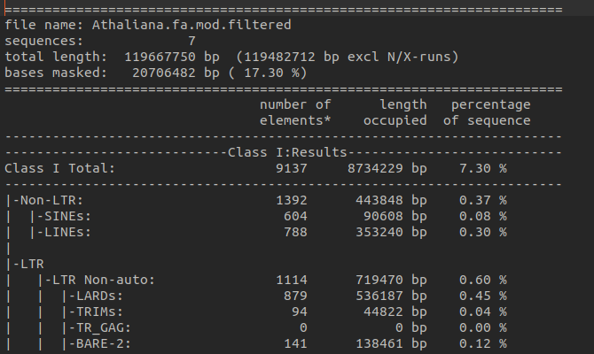
</div>
<br>

📌 ``TE-Report*``: These charts, generated from the ``TEs-Report-Lite.txt`` file, provide a clear and informative visualisation of TEs, categorised by hierarchical levels.
<div align="center">
    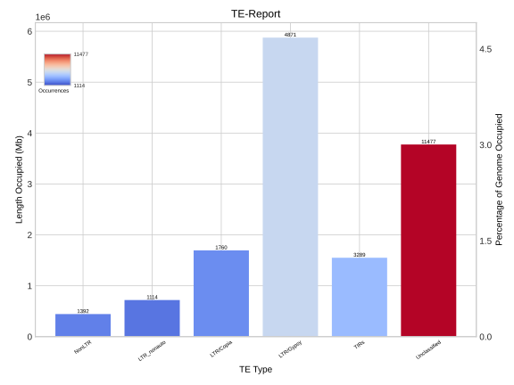
    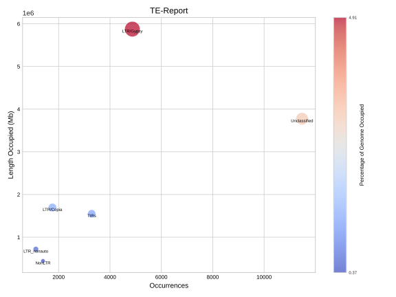
</div>
<br>

📌 ``kimura_distance_plot.pdf``: This graph provides a coherent and easily understandable inference of the relative ages of each repetitive element identified in a specific genome. The analysis is based on the genetic distance calculation proposed by Kimura, which estimates the time elapsed since duplication or insertion events of these elements. <br>
By applying Kimura’s calculation, the graph distinguishes older elements (with greater accumulated divergence) from more recent ones (with lower divergence), offering valuable insights into the evolutionary dynamics and genomic history of the organism under study.
<div align="center">
    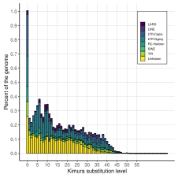
</div>


📌 ``AGE-Gypsy.pdf`` and ``AGE-Copia.pdf``: The histogram displays the age distribution of LTR elements identified in the genome. The dashed vertical lines indicate the median age, while the horizontal line represents the mean, both expressed in million years (Mya). This visualisation provides a clear analysis of the dispersion of LTR ages, highlighting the central tendency and temporal variability of these elements.
<div align="center">
    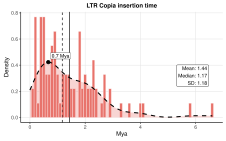
    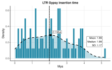
</div>


📌 ``LTR_RT-Tree1*``: These charts represent the phylogeny of lineage alignments within LTR superfamilies, providing a comprehensive visualisation of their evolutionary relationships. The phylogeny illustrates how different LTR-RT domains are related to each other based on their genetic sequences.
<div align="center">
    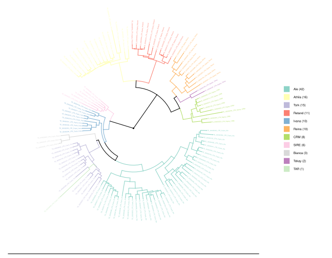
</div>
<br>

📌 ``LTR_RT-Tree2*``: A circular chart where: 
    - The outer circle (purple) represents the length (in base pairs) occupied by each element.
    - The inner circle (red) represents the number of occurrences of each element.
<div align="center">
    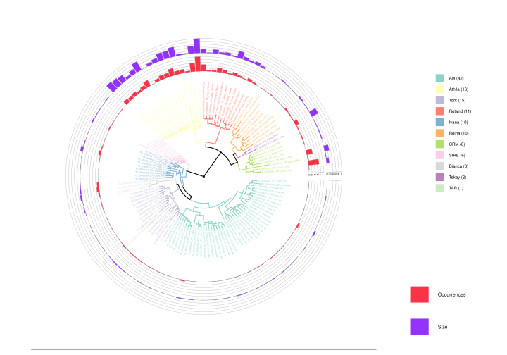
</div>
<br>

📌 ``divergence_plot*`` and ``chromosome_density*``: These files are originally generated by the EDTA pipeline and are preserved and further refined by AnnoTEP to improve visual clarity and consistency within the results framework.
<div align="center">
    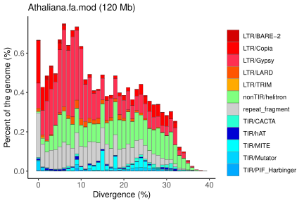
    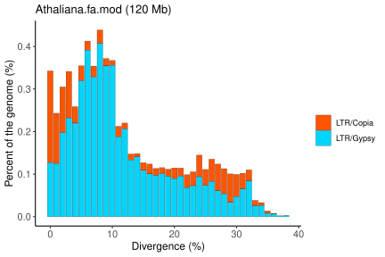
</div>

* The number of files generated by ``chromosome_density*`` may vary between genomes, with some genomes producing over 100 files.
<div align="center">
    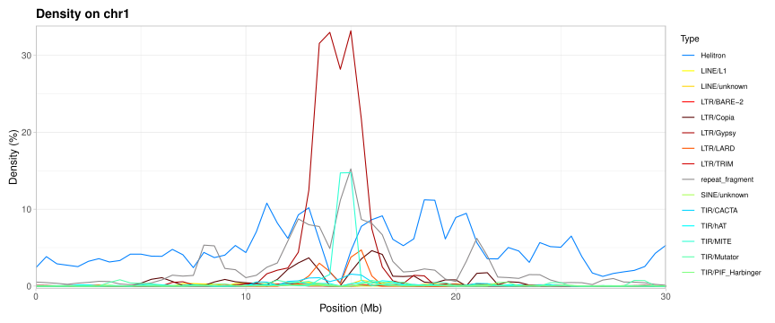
</div>

📎 Return to [Table of contents](#table-of-contents)

<br>

# List of genomes tested in this pipeline
AnnoTEP offers the capability to analyse a wide range of plants, algae, and microalgae that have not yet been explored or are underrepresented in previous studies. This approach enables the discovery of new TEs and genomic patterns that could be crucial for advancements in areas such as genomic evolution, species adaptation, and biotechnology. By focusing on less-studied genomes, AnnoTEP opens doors to groundbreaking research and contributes to filling gaps in the current understanding of TE diversity and functionality.
<br>

| Genome                                           | Common Name            | Size          |
|--------------------------------------------------|------------------------|---------------|
| _Adiantum capillus_                              | S. maidenhair fern     | 4,82 GB       |
| _Aegilops tauschii_                              | Rough-spike hard grass | 4,12 GB       |
| _Amborella trichopoda_ (v1.0)                    | Amborella              | 706,33 Mb     |
| _Ananas comosus_ (v1)                            | Pineapple              | 381,91 Mb     |
| _Anthoceros angustus_                            | Hornwort               | 119,35 Mb     |
| _Arabidopsis lyrata_ (V2.1)                      | Lyrate Rockcress       | 206,67 Mb     |
| _Arabidopsis thaliana_ (TAIR10)                  | Thale cress            | 119,67 Mb     |
| _Azolla filiculoides_                            | Mosquito fern          | 622,59 Mb     |
| _Brachypodium distachyon_ (ABR2 v1)              | Stiff brome            | 271,43 Mb     |
| _Brassica oleracea_ capitata (v1.0)              | Cabbage                | 385,01 Mb     |
| _Carnegiea gigantea_                             | Saguaro                | 1,14 Gb       |
| _Ceratodon purpureus_                            | Moss                   | 349,46 Mb     |
| _Ceratopteris richardii (v2.1)_                  | Fern                   | 7,46 GB       |
| _Chlamydomonas reinhardtii_                      | Green algae            | 114,63 Mb     |
| _Citrus sinensis_                                | Orange                 | 620,59 Mb     |
| _Coffea arabica_                                 | Arabian coffee         | 1,19 Gb       |
| _Conticribra weissflogii_                        | Diatoms                | 231,50 Mb     |
| _Cucumis sativus_                                | Cucumber               | 226,64 Mb     |
| _Cycas panshihuaensis_                           | Dukou sago palm        | 10,48 GB      |
| _Cyanophora paradoxa_                            | Freshwater Glaucophyte | 99,94 Mb      |
| _Dendrobium huoshanense_                         | Mihu                   | 1,28 GB       |
| _Diacronema lutheri_                             | Haptophytes            | 43,50 Mb      |
| _Dioscorea alata_                                | Guyana arrowroot       | 480,02 Mb     |
| _Eucalyptus grandis_ (v2.0)                      | Rose gum               | 691,35 Mb     |
| _Euglena gracilis_                               | Unicellular algae      | 2,37 Gb       |
| _Fragaria x ananassa_ (Royal Royce v1.0)         | Strawberries           | 786,54 Mb     |
| _Ginkgo biloba_                                  | Maidenhair trees       | 9,35 Gb       |
| _Glycine max_                                    | Soybean                | 1,01 Gb       |
| _Gnetum montanum_                                | Joint fir              | 3,79 Gb       |
| _Gossypium hirsutum_ (v3.1)                      | Cotton                 | 2,28 Gb       |
| _Helianthus annuus_ (r1.2)                       | Sunflower              | 3,03 Gb       |
| _Hevea brasiliensis_                             | Rubber tree            | 1,88 Gb       |
| _Isoetes taiwanensis_                            | Quillwort              | 1,66 Gb       |
| _Juglans regia_                                  | Walnut                 | 572,95 Mb     |
| _Kappaphycus striatus_                           | Green sacol            | 208,23 Mb     |
| _Lotus japonicus_                                | Miyakogusa             | 553,71 Mb     |
| _Malpighia emarginata_                           | Acerola                | 1,03 Gb       |
| _Malus domestica_ (v1.1)                         | Apple                  | 709,56 Mb     |
| _Manihot esculenta_                              | Cassava                | 639,59 Mb     |
| _Marchantia polymorpha_ (v3.0)                   | Common liverwort       | 225,76 Mb     |
| _Manihot esculenta_ (V8.1)                       | Cassava                | 639,59 Mb     |
| _Mimosa bimucronata_                             | Maricá                 | 640,55 Mb     |
| _Mimosa pudica_                                  | Sensitive Plant        | 797,25 Mb     |
| _Musa acuminata_ (Pahang)                        | Banana                 | 484,06 Mb     |
| _Nelumbo nucifera_                               | Sacred lotus           | 821,29 Mb     |
| _Nepenthes gracilis_                             | Pitcher plant          | 752,88 Mb     |
| _Oryza sativa_ (v7.0)                            | Rice                   | 374,47 Mb     |
| _Passiflora edulis_                              | Passion fruit          | 1,34 Gb       |
| _Phaseolus vulgaris_ (v2.1)                      | Common bean            | 537,22 Mb     |
| _Physcomitrium patens_ (6.1)                     | Moss                   | 481,75 Mb     |
| _Populus trichocarpa_ (v4.1)                     | Black cottonwood       | 392,16 Mb     |
| _Prunus persica_ (v2.1)                          | Peach                  | 227,41 Mb     |
| _Psidium guajava_                                | Guava                  | 443,76 Mb     |
| _Quercus rubra_ (v2.1)                           | Northern red oak       | 739,58 Mb     |
| _Saccharum officinarum x spontaneum_ R570 (v2.1) | Sugarcane              | 5,05 Gb       |
| _Salix purpurea_ (5.1)                           | Basket willow          | 329,29 Mb     |
| _Salvinia cucullata_                             | Small rat's ear        | 231,85 Mb     |
| _Selaginella moellendorffii_                     | Spikemoss              | 212,32 Mb     |
| _Setaria viridis_ (v4.1)                         | Green foxtail          | 397,28 Mb     |
| _Sherardia arvensis_                             | Field madder           | 441,30 Mb     |
| _Skeletonema tropicum_                           | Centric diatoms        | 78,78 Mb      |
| _Solanum lycopersicum_ (ITAG5.0)                 | Tomato                 | 801,81 Mb     |
| _Solanum tuberosum_ (v6.1)                       | Potato                 | 741,59 Mb     |
| _Sorghum bicolor_ (v5.1)                         | Broomcorn              | 719,89 Mb     |
| _Theobroma cacao_ (v2.1)                         | Cacao                  | 341,71 Mb     |
| _Theobroma grandiflorum_ (C174)                  | Cupuassu               | 415,77 Mb     |
| _Theobroma grandiflorum_ (C1074)                 | Cupuassu               | 423,92 Mb     |
| _Triticum aestivum_ cv Chinese Spring (v2.1)     | Bread wheat            | 14,58 Gb      |
| _Utricularia gibba_                              | Floating bladderwort   | 100,69 Mb     |
| _Vitis vinifera_ (v2.1)                          | Grape vine             | 486,20 Mb     |
| _Welwitschia mirabilis_                          | Tree Tumbo             | 6,87 Gb       |
| _Zea mays_                                       | Maize                  | 2,14 Gb       |
| _Zostera marina_                                 | Eelgrass               | 260,49 Mb     |

<br>

### Genomes Under Analysis
This section lists the genomes currently being analysed using the AnnoTEP pipeline. The results will be updated as the analysis progresses.
<br>

| Genome                                           | Common Name            | Size          |
|--------------------------------------------------|------------------------|---------------|
| -                                                | -                      | -             |

📎 Return to [Table of contents](#table-of-contents)

<br>

# Citations
- Comming Soon

# Questions and Issues
- Commig Soon