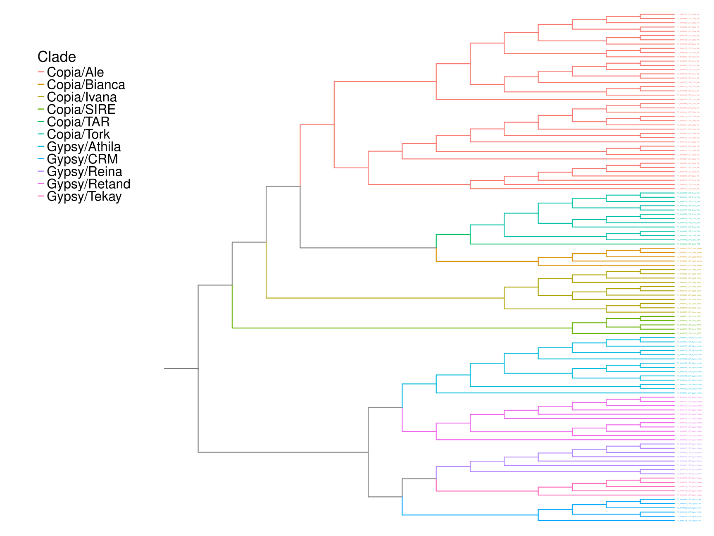
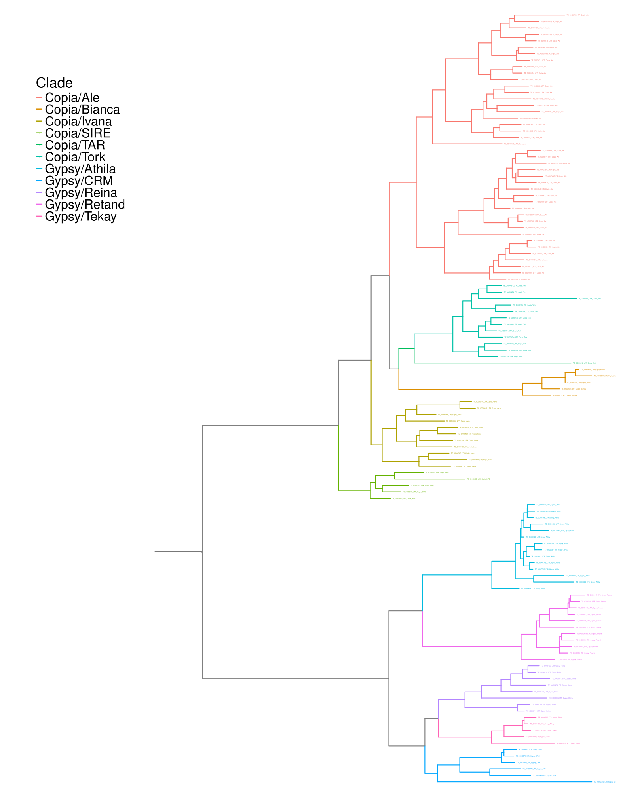
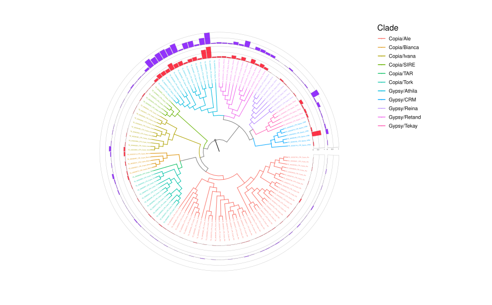

<div align="center"> 
    
</div><br>

<div align="center">

   
</div>


# AnnoTEP
AnnoTEP is a platform dedicated to the annotation of transposable elements (TEs) in plant genomes. Built on the [Plant genome Annotation](https://github.com/amvarani/Plant_Annotation_TEs) pipeline, it combines sophisticated annotation tools integrated with HTML resources to offer researchers an enhanced experience during the annotation process. By integrating these tools with a user-friendly interface, AnnoTEP aims to facilitate and optimize the work of TE annotation, providing an effective solution for plant genomic analysis.

AnnoTEP is currently available in three formats: web server, container with graphic interface and  container with bash interface. Clicking on each format below will take you to the system where you can access or install the platform:
- [Web Server](https://plantgenomics.ncc.unesp.br/AnnoTEP/) 
- [Graphic Interface](#graphic-interface)
- [Bash Interface](#bash-interface)

## Tool functions
* Identification, validation and annotation of SINE and LINE elements
* Genome masking (local mode)
* Report generation on TEs
* Generation of graphs illustrating repeated elements
* Generation of age graphs for Gypsy and Copia elements
* Generation of LTR phylogeny and density graphs
<br>

# Table of contents
* [Installation with Container](#installation-with-container)
    * [Graphic Interface](#graphic-interface)
    * [Bash Interface](#bash-interface)
    * [Results Container](#results-container)
* [Installation with Github](#installation-with-github)
    * [Organizing the environment](#organizing-the-environment)
    * [Results](#results)
    * [Running the platform with a graphical interface via github](#running-the-platform-with-a-graphical-interface-via-github)
    * [Running the platform with bash interface via github](#running-the-platform-with-bash-interface-via-github)
<br>

# Installation with Container
AnnoTEP can be installed on the machine in different ways, one of which is using Docker. The tool is available in two formats: with a graphical interface and without an interface (terminal mode). To follow the steps below, you need to have Docker installed on your machine. You can download it directly from the official [Docker website](https://docs.docker.com/engine/install/)


## Graphic Interface
<div align="center"> 
    
</div><br>

**Important**: for this version your machine must have access to the internet network

Open the terminal and run the following commands:

**Step 1.** Download the AnnoTEP image:
```sh
docker pull annotep/graphic-interface:v1
```

**Step 2.** Next, run the container with the command below, specifying a folder to store the annotation results on your machine:
```sh
docker run -it -v {folder-results}:/root/TEs/www/results -dp 0.0.0.0:5000:5000 annotep/graphic-interface:v1
```

### Description:
- ``-v {folder-results}:/root/TEs/www/results``: This creates a volume between the host and the container to store data. You can replace ``-v {folder-results}`` with any folder path on your machine, if you don't have the folder created Docker will create it. ``/root/TEs/www/results`` is the path of the directory folder, you don't need to change it.
- ``-dp 0.0.0.0:5000:5000``: Maps the container's port 5000 to the host's port 5000.
- ``annotep/graphic-interface:v1``: Specifies the image to be used.

#### Example:
```sh
docker run -it -v $HOME/results-annotep:/root/TEs/www/results -dp 0.0.0.0:5000:5000 annotep/graphic-interface:v1
```

**Step 3.** After running the container with the previous command, access the AnnoTEP interface by typing the following address into your web browser: 
``127.0.0.1:5000``

**Step 4.** When you access 127.0.0.1:5000 you will see a version of the AnnoTEP platform similar to the WEB version. 

* If you want to run tests, you can download the file _Arabidopsis thaliana_ (Chromosome 4) `AtChr4.fasta` from the repository. **Its SINE and LINE annotation can take 5 minutes and its complete annotation can take between 30 and 50 minutes if 10 threads are used for the operations**.

* This version includes a field for the number of threads to be used. This option is only valid in the full annotation, and it is recommended to have at least 4 threads on your machine. **Please note that the fewer the threads, the longer it will take to analyze the element.**

* The type of annotation and the results obtained are explained in section [Results Container](#results-container)

**Step 5.** Within the interface you can enter your data such as: email, genome and annotation type and send it for analysis. When the work is completed without any errors, you will receive an e-mail informing you that the results are available in the directory entered in ``-v {folder}``.

**Step 6:** You can follow the progress of the annotation via the Docker logs.
   * In the terminal, type ``docker ps``.
   * A list of active containers will appear. Select the ``CONTAINER ID`` of the AnnoTEP image.
   * With the ID copied, type and paste: ``docker logs {CONTAINER ID}``.

**Important2**: Avoid shutting down the machine during the process, as this could interrupt the data analysis. Even when using the web system, processing takes place locally on your machine.

**Important3**: Bear in mind that the speed of the annotation will depend on the performance of your local machine.

Return to [Table of contents](#table-of-contents)

## Bash Interface
<div align="center"> 
    
</div><br>

**Step 1.** Download the AnnoTEP image:
```sh
docker pull annotep/bash-interface:v1
```

**Step 2.** Use the ``-h`` parameter to display a user guide describing how to use the script:

```sh
docker run annotep/bash-interface:v1 python run_annotep.py -h
```
- You will be introduced to:
```sh
usage: run_annotep.py [-h] --file FILE --type {1,2,3,4} [--threads THREADS]

Run annotep with specified parameters.

optional arguments:
  -h, --help         show this help message and exit
  --threads THREADS  Number of threads used to complete annotation (default threads: 4).
                     This parameter does not need to be set for the other annotation types [1, 2, 3].

Required arguments:
  --file FILE        Genome file name (.fasta)
  --type {1,2,3,4}   Type annotation:
                      [1] SINE Annotation 
                      [2] LINE Annotation
                      [3] SINE and LINE annotation
                      [4] Complete Annotation

```

<br>

* The type of annotation and the results obtained are explained in section [Results Container](#results-container)

<br>

**Step 3.** To simplify this step, we recommend creating a folder to insert your genomic data in FASTA format. Once created, run the container using the command below as a guide. Make sure you provide the full path to the folder where you want to save the results, as well as the full path to the genomes folder:

```sh
docker run -it -v {folder-results}:/root/TEs/results -v {absolute-path-to-folder-genomes}:{absolute-path-to-folder-genomes} annotep/bash-interface:v1 python run_annotep.py --file {absolute-path-to-folder-genomes/genome.fasta} --type {type-annotation} --threads {optional}
```

### Description:
- ``-v {folder-results}:/root/TEs/results``: This creates a volume between the host and the container to store data. You can replace ``-v {folder-results}`` with any folder path on your machine where you want to save the results, if you don't have the folder created Docker will create it. ``/root/TEs/www/results`` is the directory folder path, you don't need to change it.
- ``-v {absolute-path-to-folder-genomes}:{absolute-path-to-folder-genomes}``: It is responsible for creating a temporary copy of the genomic files inside Docker, which is why you must enter the correct address of the folder that stores the genomes in ``{absolute-path-to-folder-genomes}``.
- ``--file {absolute-path-to-folder-genomes/genome.fasta}``: Here you must enter the correct address of the folder that stores the genomes along with the name of the genome you want to annotate.
- ``--type {type-annotation}``: Type of annotation shown in step 2
- ``--threads {optional}``: optional parameter for complete annotation (type 4), define the number of threads that the complete annotation (type 4) will use by default. Not necessary for other annotation types (1,2,3).

* If you want to run tests, you can download the _Arabidopsis thaliana_ (Chromosome 4) file `AtChr4.fasta` from the repository. **Its SINE and LINE annotation can take 5 minutes and its complete annotation can take between 30 and 50 minutes if 10 threads are used for the operations**.


#### Example 1:
```sh
docker run -it -v $HOME/results-annotep:/root/TEs/results -v /home/user/TEs:/home/user/TEs annotep/bash-interface:v1 python run_annotep.py --file /home/user/TEs/AtChr4.fasta --type 2

```

#### Example 2:
```sh
docker run -it -v $HOME/results-annotep:/root/TEs/results -v /home/user/TEs:/home/user/TEs annotep/bash-interface:v1 python run_annotep.py --file /home/user/TEs/AtChr4.fasta --type 4 --threads 12
```

**Step 4.** Now wait for the genome annotation to be completed by following the analysis through the terminal

Return to [Table of contents](#table-of-contents)
<br>

## Results Container
Each annotation parameter triggers different results:

 **1. SINE annotation:** Generates a folder named “SINE”, containing files in .fa format and alignment images.

 **2. LINE Annotation:** Creates a folder named “LINE”, containing files in .fa and .gff3 formats.

 **3. Complete Annotation:** Covers the generation of data for SINEs, LINEs, TIRs, Helitrons, among others. When performing this annotation, a folder called “complete-analysis” is created, containing several subfolders and files in .fa and .gff3 formats. Some of the subfolders include:
    
   *  **{genome}.fasta.mod.EDTA.raw:** Contains refined files from the SINE and LINE annotations, as well as the LTR, TIR and Helitrons annotations.
   *  **TE-REPORT:** Provides a general summary of the elements present in the genome and presents quantitative data on them.
   *  **LTR-AGE:** Analyzes the ages of the Gypsy and Copia superfamilies.
   *  **TREE:** Displays the phylogenetic trees of the LTR elements.

   The [Results](#results) section presents the additional data obtained from the complete annotation.

Return to [Table of contents](#table-of-contents)

# Installation with Github
 * The installation guide to be presented was adapted from [Plant genome Annotation](https://github.com/amvarani/Plant_Annotation_TEs), with some modifications throughout the code. 
 * **Plant Genome Annotation** uses modified code from the [AnnoSINE](https://github.com/baozg/AnnoSINE), [MGEScan-non-LTR](https://github.com/MGEScan), [TEsorter](https://github.com/zhangrengang/TEsorter) and [EDTA](https://github.com/oushujun/EDTA) pipelines.

## Prerequisites
- [Python 3.6+](https://www.python.org/)

- [Miniconda3](https://docs.conda.io/projects/miniconda/en/latest/)

- [R 4.4+](https://cran.r-project.org/bin/linux/ubuntu/fullREADME.html)

- System Ubuntu

#### MiniConda install
After downloading miniconda from the link above, run it in the terminal window:
```sh
bash Miniconda3-latest-Linux-x86_64.sh
```

## Download the repository
**Step 1.** In the terminal run:
```sh
git clone https://github.com/Marcos-Fernando/AnnoTEP.git $HOME/TEs
```

**Step 2.** Access the repository location on the machine:
```sh
cd $HOME/TEs
```

Note: Pay attention to the name of the folder. In this guide, we will be using the folder named ``TEs``. To make configuration easier, we recommend using this name.

## Configuring the repository
### Libraries
**Step 1.** In the terminal download the following libraries:
```sh
sudo apt-get install libgdal-dev lib32z1 python-is-python3 python3-setuptools python3-biopython python3-xopen trf hmmer2 seqtk
sudo apt-get install hmmer emboss python3-virtualenv python2 python2-setuptools-whl python2-pip-whl cd-hit iqtree
sudo apt-get install python2-dev build-essential linux-generic libmpich-dev libopenmpi-dev bedtools pullseq bioperl
sudo apt-get install pdf2svg

# R dependencies
sudo apt-get install r-cran-ggplot2 r-cran-tidyr r-cran-reshape2 r-cran-reshape rs r-cran-viridis r-cran-tidyverse r-cran-gridextra r-cran-gdtools r-cran-phangorn r-cran-phytools r-cran-ggrepel
```
Access the R program from the terminal and install libraries from within it:
```sh
R

install.packages("hrbrthemes")

if (!require("BiocManager", quietly = TRUE))
    install.packages("BiocManager")
BiocManager::install("ggtree")
BiocManager::install("ggtreeExtra")
```

- In the event of an error with BiocManager or the ggtree and ggtreeExtra packages, you can use another method:
```sh
if (!requireNamespace("devtools", quietly = TRUE))
    install.packages("devtools")
devtools::install_github("YuLab-SMU/ggtree")
devtools::install_github("YuLab-SMU/ggtreeExtra")

```

**Step 2.** After installing the libraries, copy the ``irf`` and ``break_fasta.pl`` scripts to local/bin on your machine:
```sh
sudo cp Scripts/irf /usr/local/bin
sudo cp Scripts/break_fasta.pl /usr/local/bin
```

**Step 3.** Then configure the TEsorter:
```sh
cd $HOME/TEs/TEsorter
sudo python3 setup.py install
```

Check the version of python on the machine to proceed with the configuration
* Python 3.7
```sh
cd /usr/local/lib/python3.7/dist-packages/TEsorter-1.4.1-py3.6.egg/TEsorter/database/
```

* Python 3.10
```sh
cd /usr/local/lib/python3.10/dist-packages/TEsorter-1.4.1-py3.10.egg/TEsorter/database/
```
...

```sh
sudo hmmpress REXdb_v3_TIR.hmm
sudo hmmpress Yuan_and_Wessler.PNAS.TIR.hmm
sudo hmmpress REXdb_protein_database_viridiplantae_v3.0_plus_metazoa_v3.hmm
sudo hmmpress REXdb_protein_database_viridiplantae_v3.0.hmm
sudo hmmpress REXdb_protein_database_metazoa_v3.hmm
sudo hmmpress Kapitonov_et_al.GENE.LINE.hmm
sudo hmmpress GyDB2.hmm
sudo hmmpress AnnoSINE.hmm
cd $HOME/TEs 
```
### Downloading genomes for testing
At this stage you can choose to use your data or download some examples for testing:
* _Theobrama cacao_
```sh
wget https://cocoa-genome-hub.southgreen.fr/sites/cocoa-genome-hub.southgreen.fr/files/download/Theobroma_cacao_pseudochromosome_v1.0_tot.fna.tar.gz
tar xvfz Theobroma_cacao_pseudochromosome_v1.0_tot.fna.tar.gz
mv Theobroma_cacao_pseudochromosome_v1.0_tot.fna Tcacao.fasta
rm Theobroma_cacao_pseudochromosome_v1.0_tot.fna.tar.gz
```

* _Arabidopsis thaliana_ 
```sh
wget https://www.arabidopsis.org/download_files/Genes/TAIR10_genome_release/TAIR10_chromosome_files/TAIR10_chr_all.fas.gz
gzip -d TAIR10_chr_all.fas.gz
cat TAIR10_chr_all.fas | cut -f 1 -d" " > At.fasta
rm TAIR10_chr_all.fas
```

* If you can't download _Arabidopsis thaliana_ automatically, you can download it directly from [tair](https://www.arabidopsis.org/download/list?dir=Genes%2FTAIR10_genome_release%2FTAIR10_chromosome_files), by clicking on `TAIR10_chr_all.fas.gz` and following the steps in the command above from the second line onwards.


## Organizing the environment
### Configuring the modified AnnoSINE
**Step 1.** Create and activate the AnnoSINE conda environment:
```sh
cd SINE/AnnoSINE/
conda env create -f AnnoSINE.conda.yaml

cd bin
conda activate AnnoSINE
```

### Configuring environment variables:
In this pipeline, we will be using HMMER version 3.4 due to a bug in version 3.3. We therefore need to configure the environment variables.

**Step 1.** Have ``vim`` installed on your machine, in the terminal type:
```sh
vim ~/.bashrc
```

A window with instructions will open, drag to the last line of the document and press the letter ``i`` to activate edit mode and type the PATH command:
```sh
export PATH="$HOME/miniconda3/envs/AnnoSINE/bin:$PATH";
export PATH="$HOME/TEs/SINE/AnnoSINE/hmmer-develop:$PATH"
export PATH="$HOME/TEs/SINE/AnnoSINE/hmmer-develop/src:$PATH"
export PATH="$HOME/TEs/SINE/AnnoSINE/hmmer-develop/bin:$PATH"
```
When finished, press the ``ESC`` button to end the editing mode, type ``:wq`` and press ``ENTER`` to save the changes and close the document.

After making the changes, restart the terminal (or close the terminal and open it again)

**Step 2.** Apply the changes and activate the environment:
```sh
source ~/.bashrc
conda activate AnnoSINE
```

Check that the current version is 3.4:
```sh
hmmsearch -h
```

If everything is correct, we can continue. If not, check the environment variables.

**Step 3.** Configuring HMMER:
```sh
cd ..
cd hmmer-develop
make clean
./configure
make -j
```

### Running AnnoSINE
**Step 1.** Run the test data (chromosome 4 of A. thaliana) to verify the installation:
```sh
python3 AnnoSINE.py 3 ../AtChr4.fasta ../Output_Files
```
- A file 'Seed_SINE.fa' will be created in '../Output_Files'. This file contains all the planned SINE elements and will be used later in the next steps.

We are now ready to annotate the SINE elements of your genome project file.

**Step 2.** In this example we will run the preloaded _A. thaliana_ genome or its data
```sh
python3 AnnoSINE.py 3 $HOME/TEs/At.fasta At
cp ./At/Seed_SINE.fa $HOME/TEs/At-Seed_SINE.fa
```

- Deactivate the environment
```sh
conda deactivate
cd $HOME/TEs
```

### Setting up MGEScan-non-LTR and primary validation with TEsorter
**Step 1.** Enter the Non-LTR folder and create a virtual environment
```sh
cd non-LTR/mgescan/

virtualenv -p /usr/bin/python2 mgescan-virtualenv
source mgescan-virtualenv/bin/activate
pip2 install biopython==1.76
pip2 install bcbio-gff==0.6.6
pip2 install docopt==0.6.1
python setup.py install
```

Follow the instructions on the installer screens.
If you are unsure about any settings, accept the defaults.

mgescan is now installed and ready to work. Test the installation:
```sh
mgescan --help
```
### Configuring environment variables:
MGEscan will use version hmmer 3.2, so we need to configure the development environment again.

**Step 1.** In the terminal type:
```sh
vim ~/.bashrc
```

A window with instructions will open, so add the following commands:
```sh
export PATH="$HOME/miniconda3/envs/AnnoSINE/bin:$PATH";
export PATH="$HOME/miniconda3/envs/EDTA/bin:$PATH";
export PATH="$HOME/TEs/non-LTR/hmmer-3.2/src/:$PATH";
```
When finished, press the ``ESC`` button to end the editing mode, type ``:wq`` and press ``ENTER`` to save the changes and close the document.

After making the changes, restart the terminal (or close the terminal and open it again)
```sh
source ~/.bashrc
```

**Step 2.** In the terminal, run (only once):
```sh
cd ..
cd hmmer-3.2
make clean
./configure
make -j
```

Now we can run MGEScan-non-LTR, in the terminal configure the directories:
```sh
cd $HOME/TEs/non-LTR
mkdir At-LINE
cd At-LINE
ln -s $HOME/TEs/At.fasta At.fasta
cd ..

# Set the ulimit higher value - See below
ulimit -n 8192
```

**Step 3.** Run MGEScan-non-LTR
```sh
mgescan nonltr $HOME/TEs/non-LTR/At-LINE --output=$HOME/TEs/non-LTR/At-LINE-results --mpi=4
```

**Step 4.** Removing false positives with TEsorter and generating the pre-final non-redundant LINE library showing compatible input for the modified EDTA pipeline:
```sh
cd At-LINE-results
```

**Step 5.** Run the following command to generate the non-redundant LINE-lib.fa file:
```sh
cat info/full/*/*.dna > temp.fa
cat temp.fa | grep \>  | sed 's#>#cat ./info/nonltr.gff3 | grep "#g'  | sed 's#$#" | cut -f 1,4,5#g'  > ver.sh
bash ver.sh  | sed 's#\t#:#' | sed 's#\t#\.\.#'   > list.txt

mkdir TMP
break_fasta.pl < temp.fa TMP/
cat temp.fa | grep \> | sed 's#>#cat ./TMP/#g' | sed 's#$#.fasta#g' > A.txt
cat temp.fa | grep \> > list2.txt
paste list2.txt list.txt | sed 's/>/ sed "s#/g'  | sed 's/\t/#/g' | sed 's/$/#g"/g'   > B.txt
paste A.txt B.txt  -d"|"  > rename.sh
bash rename.sh > candidates.fa

/usr/local/bin/TEsorter -db rexdb-plant --hmm-database rexdb-plant -pre LINE -p 22 -cov 80 -eval 0.0001 -rule 80-80-80 candidates.fa
more LINE.cls.lib  | sed 's/#/__/g'  | sed 's#.fa##g' | cut -f 1 -d" " | sed 's#/#-#g'  > pre1.fa
mkdir pre1
break_fasta.pl < pre1.fa pre1
cat pre1/*LINE.fasta  | sed 's#__#\t#g' | cut -f 1  > pre2.fa

/usr/local/bin/TEsorter -db rexdb-line --hmm-database rexdb-line -pre LINE2 -p 22 -cov 60 -eval 0.0001 -rule 80-80-80 pre2.fa
more LINE2.cls.lib  | sed 's/#/__/g'  | sed 's#.fa##g' | cut -f 1 -d" " | sed 's#/#-#g'  > pre-final.fa
mkdir pre-final
break_fasta.pl < pre-final.fa pre-final
cat pre-final/*LINE*.fasta  > pre-final2.fa
cdhit-est -i pre-final2.fa -o clustered -c 0.8 -G 1 -T 22 -d 100 -s 0.6 -aL 0.6 -aS 0.6
cat clustered | sed 's/__/#/g' | sed 's#-#/#g'  > LINE-lib.fa
#
rm -rf pre1/ pre-final/ TMP/
rm LINE2*
rm LINE.cls.*
rm A.txt B.txt clustered.clstr clustered LINE.dom* list2.txt list.txt pre1.fa pre2.fa pre-final2.fa pre-final.fa rename.sh temp.fa ver.sh candidates.fa
cp LINE-lib.fa $HOME/TEs/At-LINE-lib.fa 
```

- Deactivate the environment and return to the pipeline home screen:
```sh
deactivate
cd $HOME/TEs
```

### Configuring modified EDTA
**Step 1.** Install and activate the EDTA conda environment:
```sh
cd EDTA
bash

conda env create -f EDTA.yml
conda activate EDTA
perl EDTA.pl
```

- In some cases it may happen that the RunCmdsMP.py package is not added inside EDTA, so to avoid future errors, it is recommended to manually add the file inside the development environment folder:

    ```sh
    sudo cp $HOME/TEs/Scripts/RunCmdsMP.py $HOME/miniconda3/envs/EDTA/lib/python3.6/site-packages/
    ```


**Step 2.** Now let's use the ``At-LINE-lib.fa`` and ``At-Seed_SINE.fa`` files generated in the previous steps:
```sh
cd ..
mkdir Athaliana
cd Athaliana

nohup $HOME/TEs/EDTA/EDTA.pl --genome ../At.fasta --species others --step all --line ../At-LINE-lib.fa --sine ../At-Seed_SINE.fa --sensitive 1 --anno 1 --threads 10 > EDTA.log 2>&1 &
```

**Step 3.** Track progress by:
```sh
tail -f EDTA.log
```

**Notes:**

**1.** Set the number of threads available on your computer or server. Set the maximum available. In our code it is set to 10.

**2.** For more accurate TE detection and annotation, activate the "sensitive" flag. This will activate the RepeatModeler to identify remaining TEs and other repeats. The RepeatModeler step will also generate the Superfamily and Lineage TE classification and can capture other unknown LINEs and repeats. Our modified EDTA pipeline will do this automatically. This step is strongly recommended.

**3.** The SINE and LINE structural annotations are available in the $genome.EDTA.raw folder. Look for SINE.intact.fa, SINE.intact.gff3, LINE.intact.fa and LINE.intact.gff3

**4.** The final LINE library is embedded in the TElib.fa file. So if you want to recover all the LINEs, use this file.
<br>

---
### Smooth masking
Generally, non-autonomous elements can carry passenger genes (for example, non-autonomous LARDs and Helitrons). Therefore, for proper annotation of the genome, these elements must be partially masked. The modified EDTA pipeline will take care of this automatically and generate a suitably masked genome sequence for structural gene annotation. The softmasked genome sequence is available in the EDTA folder, with the name $genome-Softmasked.fa .

---
<br>

Return to [Table of contents](#table-of-contents)

# Results
## Generating reports
Still in the EDTA environment run:
```sh
cd $HOME/TEs
cd Athaliana
mkdir TE-REPORT
cd TE-REPORT
ln -s ../At.fasta.mod.EDTA.anno/At.fasta.mod.cat.gz .

perl $HOME/TEs/ProcessRepeats/ProcessRepeats-complete.pl -species viridiplantae -nolow -noint At.fasta.mod.cat.gz
mv At.fasta.mod.tbl TEs-Report-Complete.txt

perl $HOME/TEs/ProcessRepeats/ProcessRepeats-lite.pl -species viridiplantae -nolow -noint -a At.fasta.mod.cat.gz
mv At.fasta.mod.tbl TEs-Report-Lite.txt
```

The results obtained are: ``TEs-Report-Completo.txt`` and ``TEs-Report-Lite.txt``.
- ``TEs-Report-Complete.txt`` presents a table containing the classifications of the transposable elements, the partial elements named with the suffix “-like” (e.g. Angela-like);
<div align="center">
    
</div>

- ``TEs-Report-Lite.txt`` generates a report similar to Report-Complete, but simpler.

<div align="center">
    
</div>

Continuing in the TE-REPORT folder, we will generate the graphs, using ``TEs-Report-Lite.txt`` as a base.

```sh
cat TEs-Report-Lite.txt | grep "%"   | cut -f 2 -d":"   | awk '{print $1}' > count.txt
cat TEs-Report-Lite.txt | grep "%"   | cut -f 2 -d":"   | awk '{print $2}' > bp.txt
cat TEs-Report-Lite.txt | grep "%"   | cut -f 2 -d":"   | awk '{print $4}' > percentage.txt
cat TEs-Report-Lite.txt | grep "%"   | cut -f 1 -d":"   | sed 's# ##g'  | sed 's#-##g'  | sed 's#|##g' > names.txt
	
paste names.txt count.txt bp.txt percentage.txt | grep -w NonLTR  > plot.txt
paste names.txt count.txt bp.txt percentage.txt | grep -w LTRNonauto | sed 's#LTRNonauto#LTR_nonauto#g' >> plot.txt
paste names.txt count.txt bp.txt percentage.txt | grep -w "LTR/Copia"  >> plot.txt
paste names.txt count.txt bp.txt percentage.txt | grep -w "LTR/Gypsy"  >> plot.txt
paste names.txt count.txt bp.txt percentage.txt | grep -w "Pararetrovirus"  >> plot.txt
paste names.txt count.txt bp.txt percentage.txt | grep -w "ClassIUnknown" | sed 's#ClassIUnknown#Class_I_Unknown#g' >> plot.txt
paste names.txt count.txt bp.txt percentage.txt | grep -w "TIRs"  >> plot.txt
paste names.txt count.txt bp.txt percentage.txt | grep -w "ClassIIUnknown" | sed 's#ClassIIUnknown#Class_II_Unknown#g' >> plot.txt
paste names.txt count.txt bp.txt percentage.txt | grep -w "Unclassified"  >> plot.txt
echo "Type	Number	length	percentage" > header.txt
cat header.txt plot.txt > plot1.txt
python $HOME/TEs/Scripts/plot_TEs.py
mv TE-Report.pdf TE-Report1.pdf
pdf2svg TE-Report1.pdf TE-Report1.svg
python $HOME/TEs/Scripts/plot_TEs-bubble.py
mv TE-Report.pdf TE-Report1-bubble.pdf
pdf2svg TE-Report1-bubble.pdf TE-Report1-bubble.svg
	
paste names.txt count.txt bp.txt percentage.txt | grep -w SINEs > plot.txt
paste names.txt count.txt bp.txt percentage.txt | grep -w LINEs >> plot.txt
	
paste names.txt count.txt bp.txt percentage.txt | grep -w LARDs >> plot.txt
paste names.txt count.txt bp.txt percentage.txt | grep -w TRIMs >> plot.txt
paste names.txt count.txt bp.txt percentage.txt | grep -w TR_GAG >> plot.txt
paste names.txt count.txt bp.txt percentage.txt | grep -w BARE2 >> plot.txt
	
paste names.txt count.txt bp.txt percentage.txt | grep -w Ale >> plot.txt
paste names.txt count.txt bp.txt percentage.txt | grep -w Alesia >> plot.txt
paste names.txt count.txt bp.txt percentage.txt | grep -w Angela >> plot.txt
paste names.txt count.txt bp.txt percentage.txt | grep -w Bianca >> plot.txt
paste names.txt count.txt bp.txt percentage.txt | grep -w Bryco >> plot.txt
paste names.txt count.txt bp.txt percentage.txt | grep -w Lyco >> plot.txt
paste names.txt count.txt bp.txt percentage.txt | grep -w GymcoI >> plot.txt
paste names.txt count.txt bp.txt percentage.txt | grep -w GymcoII >> plot.txt
paste names.txt count.txt bp.txt percentage.txt | grep -w GymcoIII >> plot.txt
paste names.txt count.txt bp.txt percentage.txt | grep -w GymcoIV >> plot.txt
paste names.txt count.txt bp.txt percentage.txt | grep -w Ikeros >> plot.txt
paste names.txt count.txt bp.txt percentage.txt | grep -w Ivana >> plot.txt
paste names.txt count.txt bp.txt percentage.txt | grep -w Osser >> plot.txt
paste names.txt count.txt bp.txt percentage.txt | grep -w SIRE >> plot.txt
paste names.txt count.txt bp.txt percentage.txt | grep -w TAR >> plot.txt
paste names.txt count.txt bp.txt percentage.txt | grep -w Tork >> plot.txt
paste names.txt count.txt bp.txt percentage.txt | grep -w Ty1outgroup | sed 's#Ty1outgroup#Ty1-outgroup#g' >> plot.txt
	
paste names.txt count.txt bp.txt percentage.txt | grep -w Phygy >> plot.txt
paste names.txt count.txt bp.txt percentage.txt | grep -w Selgy >> plot.txt
paste names.txt count.txt bp.txt percentage.txt | grep -w OTA >> plot.txt
paste names.txt count.txt bp.txt percentage.txt | grep -w OTAAthila | sed 's#OTAAthila#Athila#g'  >> plot.txt
paste names.txt count.txt bp.txt percentage.txt | grep -w OTATatI | sed 's#OTATatI#TatI#g'  >> plot.txt
paste names.txt count.txt bp.txt percentage.txt | grep -w OTATatII | sed 's#OTATatII#TatII#g'  >> plot.txt
paste names.txt count.txt bp.txt percentage.txt | grep -w OTATatIII | sed 's#OTATatIII#TatIII#g'  >> plot.txt
paste names.txt count.txt bp.txt percentage.txt | grep -w OTATatOgre | sed 's#OTATatOgre#Ogre#g'  >> plot.txt
paste names.txt count.txt bp.txt percentage.txt | grep -w OTATatRetand | sed 's#OTATatRetand#Retand#g'  >> plot.txt
paste names.txt count.txt bp.txt percentage.txt | grep -w Chlamyvir >> plot.txt
paste names.txt count.txt bp.txt percentage.txt | grep -w Tcn1 >> plot.txt
paste names.txt count.txt bp.txt percentage.txt | grep -w CRM >> plot.txt
paste names.txt count.txt bp.txt percentage.txt | grep -w Galadriel >> plot.txt
paste names.txt count.txt bp.txt percentage.txt | grep -w Tekay >> plot.txt
paste names.txt count.txt bp.txt percentage.txt | grep -w Reina >> plot.txt
paste names.txt count.txt bp.txt percentage.txt | grep -w MITE >> plot.txt
paste names.txt count.txt bp.txt percentage.txt | grep -w EnSpm_CACTA | sed 's#EnSpm_CACTA#CACTA#g' >> plot.txt
paste names.txt count.txt bp.txt percentage.txt | grep -w hAT >> plot.txt
paste names.txt count.txt bp.txt percentage.txt | grep -w MuDR_Mutator | sed 's#MuDR_Mutator#MuDR#g' >> plot.txt
paste names.txt count.txt bp.txt percentage.txt | grep -w PIF_Harbinger | sed 's#PIF_Harbinger#Harbinger#g' >> plot.txt
paste names.txt count.txt bp.txt percentage.txt | grep -w "RC/Helitron" | sed 's#RC/Helitron#Helitron#g' >> plot.txt
	
cat header.txt plot.txt > plot1.txt
python $HOME/TEs/Scripts/plot_TEs.py
mv TE-Report.pdf TE-Report2.pdf
pdf2svg TE-Report2.pdf TE-Report2.svg
    
python $HOME/TEs/Scripts/plot_TEs-bubble.py
mv TE-Report.pdf TE-Report2-bubble.pdf
pdf2svg TE-Report2-bubble.pdf TE-Report2-bubble.svg
```

The data obtained will be:
<div align="center">
    
    
    
    
</div>


## Repeated landscape graphs
The landscape repeat graph is a reasonable inference of the relative ages of each element identified in a given genome. To create it we will use the file with the ``.align`` extension created after using ``ProcessRepeats-lite.pl``

In the terminal, run:
```sh
cd $HOME/TEs
cd Athaliana/TE-REPORT

cat At.fasta.mod.align  | sed 's#TIR/.\+ #TIR &#g'  | sed 's#DNA/Helitron.\+ #Helitron &#g' | sed 's#LTR/Copia.\+ #LTR/Copia &#g' | sed 's#LTR/Gypsy.\+ #LTR/Gypsy &#g'  | sed 's#LINE-like#LINE#g' | sed 's#TR_GAG/Copia.\+ #LTR/Copia &#g' | sed 's#TR_GAG/Gypsy.\+ #LTR/Gypsy &#g' | sed 's#TRBARE-2/Copia.\+ #LTR/Copia &#g' | sed 's#BARE-2/Gypsy.\+ #LTR/Gypsy &#g' | sed 's#LINE/.\+ #LINE &#g' > tmp.txt
#

cat tmp.txt  | grep "^[0-9]"  -B 6 |  grep -v "\-\-"  | grep "LTR/Copia" -A 5 |  grep -v "\-\-"  > align2.txt
cat tmp.txt  | grep "^[0-9]"  -B 6 |  grep -v "\-\-"  | grep "LTR/Gypsy" -A 5 |  grep -v "\-\-"  >> align2.txt
cat tmp.txt  | grep "^[0-9]"  -B 6 |  grep -v "\-\-"  | grep "TIR" -A 5 |  grep -v "\-\-"  >> align2.txt
cat tmp.txt  | grep "^[0-9]"  -B 6 |  grep -v "\-\-"  | grep "LINE" -A 5 |  grep -v "\-\-"  >> align2.txt
cat tmp.txt  | grep "^[0-9]"  -B 6 |  grep -v "\-\-"  | grep "LARD" -A 5 |  grep -v "\-\-"  >> align2.txt
cat tmp.txt  | grep "^[0-9]"  -B 6 |  grep -v "\-\-"  | grep "TRIM" -A 5 |  grep -v "\-\-"  >> align2.txt
cat tmp.txt  | grep "^[0-9]"  -B 6 |  grep -v "\-\-"  | grep "Helitron" -A 5 |  grep -v "\-\-"  >> align2.txt
cat tmp.txt  | grep "^[0-9]"  -B 6 |  grep -v "\-\-"  | grep "SINE" -A 5 |  grep -v "\-\-"  >> align2.txt
cat tmp.txt  | grep "^[0-9]"  -B 6 |  grep -v "\-\-"  | grep "Unknown" -A 5 |  grep -v "\-\-"  >> align2.txt
#

perl $HOME/TEs/ProcessRepeats/calcDivergenceFromAlign.pl -s At.divsum align2.txt

genome_size="`perl $HOME/TEs/EDTA/util/count_base.pl ../At.fasta.mod | cut -f 2`" 
perl $HOME/TEs/ProcessRepeats/createRepeatLandscape.pl -g $genome_size -div At.divsum > ../RepeatLandscape.html

tail -n 72 At.divsum > divsum.txt

cat $HOME/TEs/Rscripts/plotKimura.R | sed "s#_SIZE_GEN_#$genome_size#g" > plotKimura.R

Rscript plotKimura.R
mv Rplots.pdf RepeatLandScape.pdf
pdf2svg RepeatLandScape.pdf RLandScape.svg

rm align2.txt
rm tmp.txt
```

The graphics obtained will be: ``RepeatLandScape.pdf`` and ``RLandScape.svg``.
<div align="center">
    
</div>

### LTR age plot (Gypsy and Copia)
To plot the ages of the LTR Gypsy and LTR Copia elements, we will use a ggplot2 Rscript.
```sh
cd $HOME/TEs
cd Athaliana
mkdir LTR-AGE
cd LTR-AGE
ln -s ../At.fasta.mod.EDTA.raw/At.fasta.mod.LTR-AGE.pass.list .

ln -s $HOME/TEs/Rscripts/plot-AGE-Gypsy.R .
ln -s $HOME/TEs/Rscripts/plot-AGE-Copia.R .

cat -n At.fasta.mod.LTR-AGE.pass.list  | grep Gypsy  | cut -f 1,13 | sed 's# ##g'  | sed 's#^#Cluster_#g' | awk '{if ($2 > 0) print $n}'   > AGE-Gypsy.txt
cat -n At.fasta.mod.LTR-AGE.pass.list  | grep Copia  | cut -f 1,13 | sed 's# ##g'  | sed 's#^#Cluster_#g' | awk '{if ($2 > 0) print $n}'   > AGE-Copia.txt

Rscript plot-AGE-Gypsy.R
Rscript plot-AGE-Copia.R

pdf2svg AGE-Copia.pdf AGE-Copia.svg
pdf2svg AGE-Gypsy.pdf AGE-Gypsy.svg
```
The final files are: ``AGE-Copia.pdf``, ``AGE-Gypsys.pdf``, ``AGE-Copia.svg`` and ``AGE-Gypsy.svg``.

<div align="center">
    
    
</div>

### Plotting LTR elements Phylogeny and Density
Plotting the phylogeny of the alignments of all the LTR-RT domains.
```sh
cd $HOME/TEs
cd Athaliana
mkdir TREE
cd TREE

ln -s ../At.fasta.mod.EDTA.TElib.fa .
cat At.fasta.mod.EDTA.TElib.fa | sed 's/#/_CERC_/g'  | sed 's#/#_BARRA_#g'  > tmp.txt

mkdir tmp
break_fasta.pl < tmp.txt ./tmp
cat tmp/*LTR* | sed 's#_CERC_#\t#g' | cut -f 1 > TE.fasta
rm -f tmp.txt ; rm -f At.fasta.mod.EDTA.TElib.fa ; rm -Rf tmp

/usr/local/bin/TEsorter -db rexdb-plant --hmm-database rexdb-plant -pre TE -dp2 -p 40 TE.fasta

concatenate_domains.py TE.cls.pep GAG > GAG.aln
concatenate_domains.py TE.cls.pep PROT > PROT.aln
concatenate_domains.py TE.cls.pep RH > RH.aln
concatenate_domains.py TE.cls.pep RT > RT.aln
concatenate_domains.py TE.cls.pep INT > INT.aln

cat GAG.aln | cut -f 1 -d" " > GAG.fas
cat PROT.aln | cut -f 1 -d" " > PROT.fas
cat RH.aln | cut -f 1 -d" " > RH.fas
cat RT.aln | cut -f 1 -d" " > RT.fas
cat INT.aln | cut -f 1 -d" " > INT.fas

perl $HOME/TEs/Scripts/catfasta2phyml.pl -c -f *.fas > all.fas
iqtree2 -s all.fas -alrt 1000 -bb 1000 -nt AUTO 

cat TE.cls.tsv | cut -f 1 | sed "s#^#cat ../At.fasta.mod.EDTA.TEanno.sum | grep -w \"#g"  | sed 's#$#"#g'   > pick-occur.sh
bash pick-occur.sh  > occur.txt

cat occur.txt  | sed 's#^      TE_#TE_#g'  | awk '{print $1,$2,$3}' | sed 's# #\t#g' |  sort -k 2 -V  > sort_occur.txt
cat occur.txt  | sed 's#^      TE_#TE_#g'  | awk '{print $1,$2,$3}' | sed 's# #\t#g' |  sort -k 3 -V  > sort_size.txt
cat all.fas  | grep \> | sed 's#^>##g'   > ids.txt

cat sort_occur.txt | cut -f 1,2 | sed 's#^#id="#g' | sed 's#\t#" ; data="#g' | sed 's#$#" ; ver="`cat ids.txt | grep $id`" ; echo -e "$ver\\t$data" #g'   > pick.sh
bash pick.sh  | grep "^TE" | grep "^TE"  | sed 's/#/_/g' | sed 's#/#_#g'  > occurrences.tsv

cat sort_size.txt | cut -f 1,3 | sed 's#^#id="#g' | sed 's#\t#" ; data="#g' | sed 's#$#" ; ver="`cat ids.txt | grep $id`" ; echo -e "$ver\\t$data" #g'   > pick.sh
bash pick.sh  | grep "^TE" | grep "^TE"  | sed 's/#/_/g' | sed 's#/#_#g'  > size.tsv

rm -f pick-occur.sh sort_occur.txt sort_size.txt ids.txt pick.sh

ln -s $HOME/TEs/Rscripts/LTR_tree.R .
ln -s $HOME/TEs/Rscripts/LTR_tree-density.R .
ln -s $HOME/TEs/Rscripts/LTR_tree_rec_1.R .
ln -s $HOME/TEs/Rscripts/LTR_tree_rec_2.R .

Rscript LTR_tree.R all.fas.contree TE.cls.tsv LTR_RT-Tree1.pdf
Rscript LTR_tree-density.R all.fas.contree TE.cls.tsv occurrences.tsv size.tsv LTR_RT-Tree2.pdf
Rscript LTR_tree_rec_1.R all.fas.contree TE.cls.tsv LTR_RT-Tree3.pdf
Rscript LTR_tree_rec_2.R all.fas.contree TE.cls.tsv LTR_RT-Tree4.pdf

pdf2svg LTR_RT-Tree1.pdf LTR_RT-Tree1.svg
pdf2svg LTR_RT-Tree2.pdf LTR_RT-Tree2.svg
pdf2svg LTR_RT-Tree3.pdf LTR_RT-Tree3.svg
pdf2svg LTR_RT-Tree4.pdf LTR_RT-Tree4.svg
```
The files generated will be: ``LTR_RT-Tree1.pdf``, ``LTR_RT-Tree2.pdf``, ``LTR_RT-Tree3.pdf``, ``LTR_RT-Tree4.pdf``, ``LTR_RT-Tree1.svg``, ``LTR_RT-Tree2.svg``, ``LTR_RT-Tree3.svg`` and ``LTR_RT-Tree2.svg``.

<div align="center">
    
    
    
    
</div>

- The outer circle (purple) represents the length (in bp) occupied by each element, while the inner circle (red) represents the number of occurrences of each element.

<br>

Return to [Table of contents](#table-of-contents)

<br>

# Running the platform with a graphical interface via github
**Step 1.** Access the ``graphic-interface`` folder folder and create a Python virtual environment by running the following commands in your terminal. Make sure you have done the [environment setup](#organizing-theenvironment) before proceeding.
```sh
python -m venv .venv

. .venv/bin/activate
```

**Important 4**: If you cloned the git repository to a directory different from the recommended one, which is **$HOME/TEs**, you will need to adjust some lines of code to avoid potential issues.

Follow these steps:

**1. Adjust the main.py file:**
- Inside the `graphic-interface` folder, locate the file named `main.py`.
- Open the file and find the following line of code:
```sh
    UPLOAD_FOLDER = os.path.join(os.environ['HOME'], 'TEs')
```

 - Modify this line to reflect the directory where you installed the repository. For example:

```sh
    UPLOAD_FOLDER = {folder installation location}
    
    #or

    UPLOAD_FOLDER = os.path.join(os.environ['HOME'], 'new_directory') 
```
- Replace "new_directory" with the correct path of the folder where the repository was cloned.

**2. Adjust the annotation.py file:**
- Still in the `graphic-interface` folder, go to the `extensions` subfolder and locate the `annotation.py` file.
- Repeat the same process: find the line of code that defines the UPLOAD_FOLDER path:
```sh
    UPLOAD_FOLDER = os.path.join(os.environ['HOME'], 'TEs')
```

- Change this line to the new directory where the repository was installed, just like in the previous example:

```sh
    UPLOAD_FOLDER = {folder installation location}

    #or

    UPLOAD_FOLDER = os.path.join(os.environ['HOME'], 'new_directory') 
```

By following these steps, the system will correctly recognize the new installation path, preventing any errors during processing.

<br>

**Step 2:** Install the packages needed for the application by running the following command (this only needs to be done once):
```sh
pip install -r required.txt 
```
- Inside the ``required.txt`` file, you'll find the fundamental libraries, such as Flask and python-dotenv. If any package shows an error, you'll need to install it manually.

**Step 3:** Now, inside the "graphic-interface" folder and with the virtual environment activated, run the following command to start the application:
```sh
flask run
```

If all the settings are correct, you will see a message similar to this one:
```sh
 * Serving Flask app 'main.py' (lazy loading)
 * Environment: development
 * Debug mode: on
 * Running on http://127.0.0.1:5000/ (Press CTRL+C to quit)
 * Restarting with stat
 * Debugger is active!
 * Debugger PIN: 264-075-516
```

**Step 4.** Click on the link http://127.0.0.1:5000/ or copy and paste it into your browser to access the platform and start testing it.
<br>

* The type of annotation and the results obtained are explained in section [Results Container](#results-container)

<br>

# Running the platform with bash interface via github
- This mode is entirely command-line based, so there's no need to create a development environment. Make sure you have done the [environment setup](#organizing-theenvironment) before proceeding.
- Go to the ``bash-interface`` folder

**Important 5**: Just like in the `graphic-interface` folder, if you cloned the git repository to a directory different from the suggested one, which is **$HOME/TEs**, you will need to adjust some lines of code to avoid potential issues.

Follow these steps:

- Inside the `bash-interface` folder, locate the file named `run_annotep.py`.
- Open the file and find the following line of code:

```sh
    UPLOAD_FOLDER = os.path.join(os.environ['HOME'], 'TEs')
```

- Modify this line to reflect the directory where you installed the repository. For example:

```sh
    UPLOAD_FOLDER = {folder installation location}

    #or

    UPLOAD_FOLDER = os.path.join(os.environ['HOME'], 'new_directory') 
```
- Replace "new_directory" with the correct path of the folder where the repository was cloned.

By following these steps, the system will correctly recognize the new installation path, preventing any errors during processing.

<br>

**Step 1.** Go to the "local" folder and run the ``run_annotep.py`` script by typing the following command:
```sh
python run_annotep.py -h
```

- The ``-h`` parameter displays a user guide describing how to use the script:
```sh
usage: run_annotep.py [-h] --file FILE --type {1,2,3,4} [--threads THREADS]

Run annotep with specified parameters.

optional arguments:
  -h, --help         show this help message and exit
  --threads THREADS  Number of threads used to complete annotation (default threads: 4).
                     This parameter does not need to be set for the other annotation types [1, 2, 3].

required arguments:
  --file FILE        Genome file name (.fasta)
  --type {1,2,3,4}   Type annotation:
                      [1] SINE Annotation 
                      [2] LINE Annotation
                      [3] SINE and LINE annotation
                      [4] Complete Annotation

```

**Step 2:** Run the command adding the full path of the directory containing the genome and the type of annotation you want:
```sh

python run_annotep.py --file {absolute-path-to-folder-genomes}/genome.fasta --type number
```

#### Example 1:
```sh
python run_annotep.py --file /home/user/TEs/At.fasta --type 2
```

#### Example 2:
```sh
python run_annotep.py --file $HOME/TEs/At.fasta --type 4 --threads 10
```

<br>

* The type of annotation and the results obtained are explained in section [Results Container](#results-container)

Return to [Table of contents](#table-of-contents)