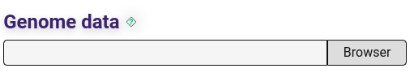
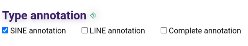

# Using AnnoTEP Home server with interface
### Staying informed about the annotation process
To start the annotation process and obtain information on the progress of your work, you need to provide your e-mail address in the panel.

 
     

 

After submitting, you will receive a confirmation e-mail and then a second e-mail will be sent as soon as the annotation process is complete.

## Entering input data
The ideal data input accepted by the AnnoTEP platform is FASTA format files containing the chromosomes of plant genomes. The "Genome Data" panel allows you to select the file on your machine.

 
     

 

## Annotation systems
Before submitting your annotations, you need to choose the type of annotation you want to make, by default the SINE annotation is already selected, so confirm your selections before submitting your data.

 
     

 

The annotation system allows you to make four different types of annotations:
- **Selecting SINE Annotation:** This option exclusively analyzes the SINE elements present in the plant genome, generating libraries containing specific SINE sequences.

- **Selecting LINE Annotation:** This option exclusively analyzes the LINE elements present in the plant genome, generating libraries containing specific LINE sequences.

- **Selecting SINE and LINE Annotation (Together):** This choice leads to the joint analysis of SINEs and LINEs elements in the plant genome, generating libraries containing sequences from both categories.

- **Selecting Complete Annotation:** This option performs a comprehensive analysis of the SINEs and LINEs elements, including an in-depth analysis using libraries of both elements. In addition to the conventional outputs, such as tables of TRIM, LARD, TR_GAG, BARE-2, MITES, Helitron, Gypsy Family and Copia Family elements, age graphs are generated for the Gypsy and Copia families, as well as a phylogenetic tree.

## Sending data
Once you have entered all the necessary data, you can click on the "submit" button and send your genome for analysis. When the job is completed without any errors, you will receive an e-mail informing you that the results are available.

## Results
When the annotation is complete, the results will be accessible in your designated folder, located in the path specified for the storage volume (such as: ``-v $HOME/results:/root/TEs/www/results``). This means that you will find the results directly in your defined local folder after the annotation process.

Inside the results folder you will find the following files:
- **SINE folder -** contains the data generated from the SINE annotation or full annotation.

- **LINE-results folder -** contains the data generated through LINE annotation or complete annotation. 

- **Complete-analysis folder -** obtained through the complete annotation, in this folder, in addition to the graphs, trees and tables generated, it brings elements masked by means of $genome-Softmasked.fa and the new structural annotations SINEs and LINEs, available in the folder $genome.EDTA.raw. ($genome = name of the genome worked on). Look for SINE.intact.fa, SINE.intact.gff3, LINE.intact.fa and LINE.intact.gff3, plus a final analysis of LINEs elements available in $genome.TElib.fa.lask 
